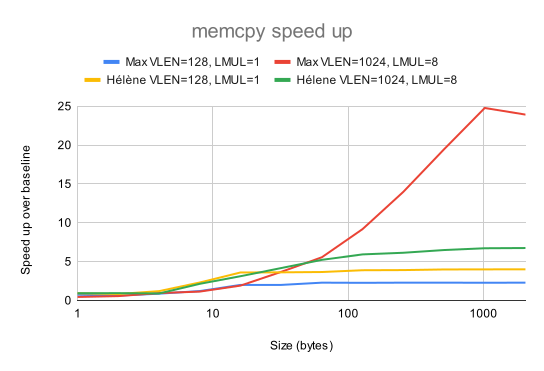
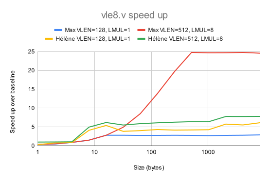
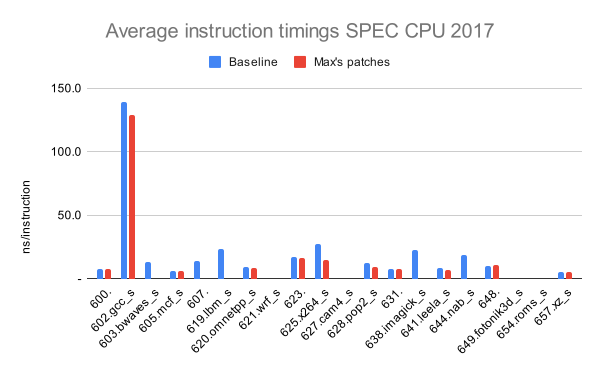
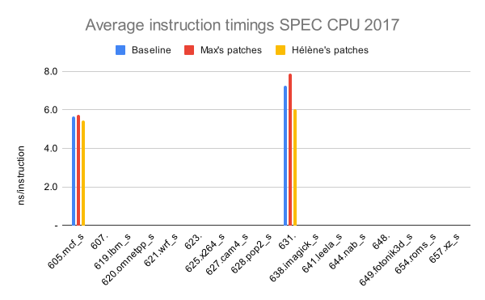

# RISE RP005 QEMU weekly report 2024-06-19

# Overview

## The project team
- Paolo Savini (Embecosm)
- Hélène Chelin (Embecosm)
- Jeremy Bennett (Embecosm)
- Hugh O'Keeffe (Ashling)
- Nadim Shehayed (Ashling)
- Daniel Barboza (Ventana)

## Work completed since last report

- WP2:
  - Get SPEC CPU 2017 results for Hélène Chelin's optimization of the `vle8.v` instruction:
    - a bug means we only have confident results for two benchmarks (`605.mcf_s` and `631.deepsjeng_s`), but these both show an improvement in average QEMU instruction execution times;
    - we have also measured Max Chou's patches, which work with far more benchmarks, which also show an overall improvement in average instruction execution times, in some cases very substantial, but in different places to Hélène's patch;
	- our next step is to synthesize the approaches, using Max's patches as the starting point.
  - Optimize the tail bytes of `vle8.v`:
    - deferred to prioritize the merging of our work on top of Max's patches.
  - Explore optimization through the usage of builtins like `__builtin_memcpy`:
    - this is already part of the approach from Max, which we will build on.

- WP3:
  - The ARM environment is set up.

## Work planned for the coming two weeks

With RISC-V European Summit and staff holidays we have scheduled a smaller amount of work for the next two weeks.

- WP2
  - fix the bug in Hélène's patch.
  - extend Max's patch using ideas from Hélène's patch.
  - measure the performance of the combined patch on individual instructions, memory functions and SPEC CPU 2017.
  - extend the combined patch for efficient handling of large loads/stores (> 64 bits).

## Current priorties

Our current set of agreed priorities are as follows

- vector load/store ops for x86_64 AVX
- vector load/store ops for AArch64/Neon
- vector integer ALU ops for x86_64 AVX
- vector load/store ops for Intel AVX10

For each of these there will be an analysis phase and an optimization phase, leading to the following set of work packages.
- WP0: Infrastructure
- WP1: Analysis of vector load/store ops on x86_64 AVX
- WP2: Optimization of vector load/store ops on x86_64 AVX
- WP3: Analysis of vector load/store ops on AArch64/Neon
- WP4: Optimization of vector load/store ops on AArch64/Neon
- WP5: Analysis of integer ALU ops on x86_64 AVX
- WP6: Optimization of integer ALU ops on x86_64 AVX
- WP7: Analysis of vector load/store ops on Intel AVX10
- WP8: Optimization of vector load/store ops on Intel AVX10

These priorities can be revised by agreement with RISE during the project.

# Detailed description of work

## WP2

We spent some time ironing out bugs in the high-level patch ("Hélène's patch"), which now works reliably with the `memcpy` and individual instruction tests, butstill has a problem with many SPEC CPU 2017 benchmarks.  We also measured the impact of Max Chou's patch ("Max's patch") for comparison.

The two patches work in different ways to achieve significnant performance improvements.  Going forward our strategy will be to take the best ideas from Hélène's to apply on top of Max's patch and thus gain the best from both approaches.

# Statistics

## `memcpy` performance of Max and Hélène's patches

This is our standard benchmark, which we evaluate for: i) small vectors with `LMUL=1`; and ii) large vectors with `LMUL=8`.  We show the speed up over the baseline performance with no patch applied.  The full data are in [this Google spreadsheet](https://docs.google.com/spreadsheets/d/1B5TsbgyhmSi7pey-oJacE1w-WIN5iMQ66404dJU06W4) and summarized in the following graph.

:

In summary Max's patch is more effective for large vectors with LMUL=8 and Hélène's patch is more effective for small vectors with LMUL=1.  In both cases there is a loss of performance for small sizes.

## Individual RVV instruction performance x86

We also measured the performance of `vle8.v` for each patch.  Again we show speed up over baseline with no patch.  The full data are in [this Google spreadsheet](https://docs.google.com/spreadsheets/d/1F74DDEcu7eYs5jsyrAQebb1EYz7avI6wovXrgnsyLhM) and summarized in the following graph.

:

As with `memcpy`, Max's patch is best for large vectors and `LMUL=8`, Hélène's patch is best for small vectors and `LMUL=1` and both patches reduce performance for the smallest sizes.

## SPEC CPU 2017 performance

All benchmarks are compiled using the GCC 14.1 tool chain with rv64gcv as the architecture.  We use the speed benchmarks, which are run using the test datasets.

Our expectation is that since we are only changing QEMU, not the executables, the SPEC CPU ratios obtained should be almost the same.  They will not be identical, because the SPEC programs interact with the external world (files etc), and timing differences in these interactions will affect the exact number of instructions executed.  The use of the small test datasets mean these differences will be slightly more than would be expected for the reference runs, but they should still be insignificant.

Current limitations of the test scripts mean that some report as failing checks, when they are in fact correct.  This will be resolved in future.  As a simple sanity check, we reject any benchmark where there is no timing data, or where the SPEC CPU score has greater than 0.01% variation from the baseline.

The data are captured in [this Google Spreadsheet](https://docs.google.com/spreadsheets/d/1xlLE75HsA6B4pk35bkasECKMCpZn199jvlXjpgT42Q8).

### SPEC CPU 2017 and Max's patches

Overall 11 of the 20 benchmarks passed the sanity test.  Average instruction execution time improved from 17.0 ns/instr to 11.1 ns/instr.  The biggest wins were for benchmarks like `625.x264_s` which are very amenable to vectorization (from 27.6 ns/instr to 14.5 ns/instr), while for three benchmarks (`605.mcf_s`, `631.deepsjeng_s` and `648.exchange2_s`) the average execution time per instruction was slightly worse.  The results are summarized in the following graph.

:

### SPEC CPU 2017 and Hélène's patches

It became apparent that there remains a bug in this approach, likely based due t a side effect from simplifying at such a high level.  However we do have two SPEC CPU benchmarks which pass the sanity tests, and they give useful datapoints.

:

Both happen to be points where Max's patches reduce performance, but where Hélène's patches improve performance.  The approaches look to be complementary, so we are now looking at how we can apply this high level approach on top of the lower level approach used by Max.

# Actions

2024-06-05
- **Paolo** Check behaviour of QEMU with tail bytes.
  - Deferred to prioritize host targeted optimization work.

- **Paolo** Look at the patches from Max Chou.
  - **COMPLETE.** Merged in the code base, our work will be based on top of these.
  - **COMPLETE.** Gathered measurements. See above.

2024-05-15

- **Jeremy** to look at impact of masked v unmasked and strided v unstrided on vector operations.
  - lower proirity.

2024-05-08

- **Jeremy** to characterise QEMU floating point performance and file it as a performance regression issue in QEMU GitLab.
  - low priority, deferred to prioritize the smoke tests work.

2024-05-01

- **Paolo** to review the generic [issue](https://gitlab.com/qemu-project/qemu/-/issues/2137) from Palmer Dabbelt to identify ideas for optimization and benchmarks to reuse.
  - **COMPLETE** See action from 2024-06-05 above.

- **Daniel** to advise **Paolo** on best practice for preparing QEMU upstream submissions.

# Risk register

The risk register is held in a shared [spreadsheet](https://docs.google.com/spreadsheets/d/1mHNwGGGPJ-ls0pgCbvkSdGDoKW4vftzYWeIPPYZYfjY/edit?usp=sharing), which is updated continuously.

There are no changes to the risk register this week.

# Planned absences

- Paolo will be on vacation from the 20-24 of June.
- Jeremy, Hugh and Nadim are at the RISC-V Euro Summit from 24-27 June
  - they look forward to meeting project participants there.
