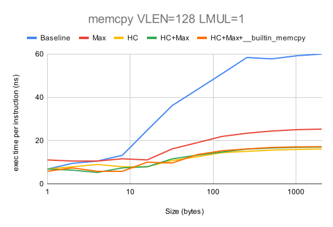
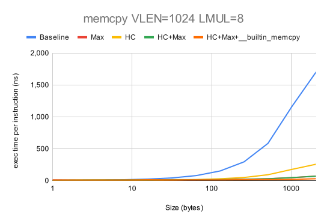
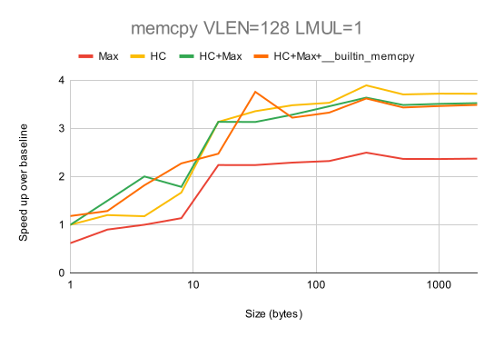
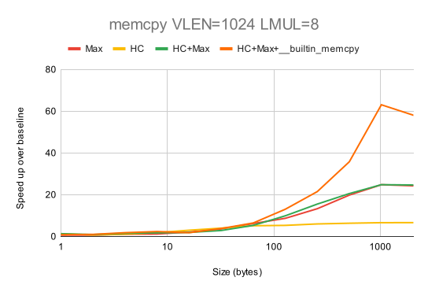
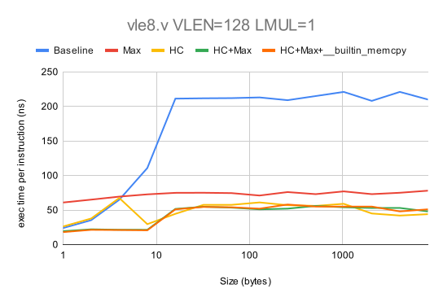
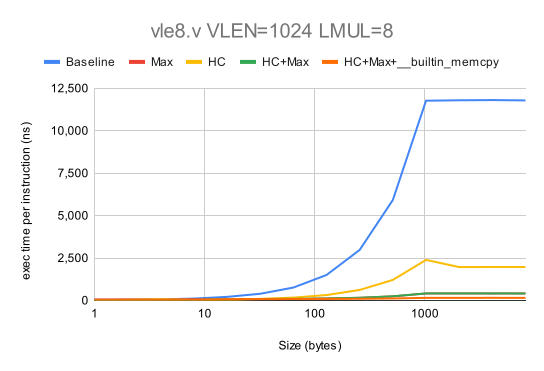
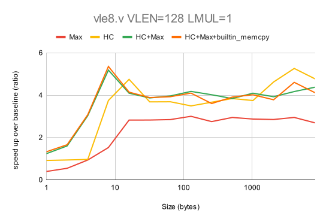
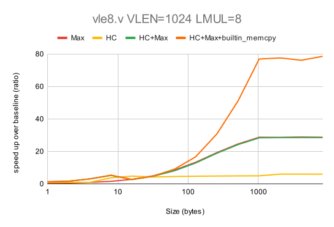
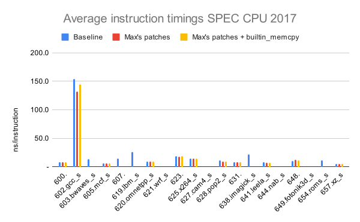

# RISE RP005 QEMU weekly report 2024-07-03

# Overview

We have extended Max Chou's patch to use __builtin_memcpy, which improves SPEC CPU 2017 QEMU instruction performance by up to 18% (although a minority of benchmarks are slowed).
Héléne Chelin's patch on top of Max's patch speeds up memcpy benchmarks by up to 12x, but causes SPEC CPU 2017 to fail.

## The project team
- Paolo Savini (Embecosm)
- Hélène Chelin (Embecosm)
- Jeremy Bennett (Embecosm)
- Hugh O'Keeffe (Ashling)
- Nadim Shehayed (Ashling)
- Daniel Barboza (Ventana)

## Work completed since last report

- WP2
  - fix the bug in Hélène's patch.
    - In progress.
  - extend Max's patch using ideas from Hélène's patch.
    - Initial version complete. Will need repeating when the bug above is fixed.
  - measure the performance of the combined patch on individual instructions, memory functions and SPEC CPU 2017.
    - Complete. See below.
  - extend the combined patch for efficient handling of large loads/stores (> 64 bits).
    - Complete. See below.

## Work planned for the coming two weeks

- WP2
  - Explore optimizations of the calls to vsetvl/vsetvli.
  - Analyze SPECCPU:
    - instrument SPECCPU to get and estimate of the most used vector load/store sizes.
      - will be extensible to the analysis of other instructions.
    - analyze the variability of SPECCPU scores.
      - the 4 benchmarks where Max's patches and ours give a different instruction count.
    - analyze the remaining failures.
      - fix the bugs in the HC patches that cause the SPECCPU failures.
  - Verify that the use __builtin_memcpy triggers vector instructions.

## Current priorities

Our current set of agreed priorities are as follows

- vector load/store ops for x86_64 AVX
- vector load/store ops for AArch64/Neon
- vector integer ALU ops for x86_64 AVX
- vector load/store ops for Intel AVX10

For each of these there will be an analysis phase and an optimization phase, leading to the following set of work packages.
- WP0: Infrastructure
- WP1: Analysis of vector load/store ops on x86_64 AVX
- WP2: Optimization of vector load/store ops on x86_64 AVX
- WP3: Analysis of vector load/store ops on AArch64/Neon
- WP4: Optimization of vector load/store ops on AArch64/Neon
- WP5: Analysis of integer ALU ops on x86_64 AVX
- WP6: Optimization of integer ALU ops on x86_64 AVX
- WP7: Analysis of vector load/store ops on Intel AVX10
- WP8: Optimization of vector load/store ops on Intel AVX10

These priorities can be revised by agreement with RISE during the project.

# Detailed description of work

## WP2

### Combined patches

We applied the approach used in the HC patches to Max's patches for small loads and stores (<= 64 bits) and with LMUL=1 when the VLEN is 128 bits.

The merge consists of managing the load or store in the above conditions with 64 bit loads/stores and then smaller loads/stores as the bytes to process run out.

The overall effect on the memcpy benchmark is that we obtain both the gain of performance of Max's patches for the larger sizes and the gain of performance on the small sizes provided by the HC patches. See results in the statistics below.

### Large loads and stores

We added the use of __builtin_memcpy for loads and stores of 128 and 256 bits and we obtained a further improvement of performance for large loads and stores.

# Statistics

## `memcpy` performance of combined patches + __builtin_memcpy

This is our standard benchmark, which we evaluate for: i) small vectors with `LMUL=1`; and ii) large vectors with `LMUL=8`.  We show the speed up over the baseline performance with no patch applied.  The full data are in [this Google spreadsheet](https://docs.google.com/spreadsheets/d/1lGPp2tmAPhzFwJfUZtmbyYUaszHwvK1UqVovC4j_Wl4/edit?usp=sharing) and summarized in the following graph.

:

:

:

:

## Individual RVV instruction performance x86

Here is the the performance of `vle8.v`/`vse8.v` for each patch.  The full data are in [this Google spreadsheet](https://docs.google.com/spreadsheets/d/1VYwDk230Qe5DsO_rVOYwhNtQSMsLKSdI0a_XLAVsh5A/edit?usp=sharing) and summarized in the following graph.

:

:

:

:

As with the memcpy benchmark results, the merge of the HC-Max approaches is promising for the smaller sizes and VLEN=128, LMUL=1.
The use of __builtin_memcpy on top of Max's patches shows promise for larges sizes.

## SPEC CPU 2017 performance

All benchmarks are compiled using the GCC 14.1 tool chain with rv64gcv as the architecture.  We use the speed benchmarks, which are run using the test datasets.

### SPEC CPU 2017 and combined patches

We looked at four cases, in which we incrementally added functionality

1. Baseline top-of-tree QEMU
2. Max Chou's patch on top of baseline
3. `__builtin_memcpy` patch on top of Max's patch
4. Hélène Chelin's patch on top of all the above.

For the final one of these we did not get correct SPEC CPU 2017 results, even though this patch worked correctly with the small memcpy tests.  These results are excluded from the rest of the analysis.

The detailed results are in this [Google spreadsheet](https://docs.google.com/spreadsheets/d/16SXZxGaIM6kMK2rr4-kHmtzfOF_z32uwwKa51qsEIhk).  The following graph shows the relative performance (average ns/instruction) for each benchmark, all compiled with RISC-V Vector (RVV) enabled.

:

Some key observations.

- 4 benchmarks did not yield an instruction count with baseline QEMU
- 1 other benchmark did not yield an instruction count with Max's patches, but did when Max's patches were combined with `__builtin_memcpy`.
- 4 of the remaining  benchmarks when run with Max's patches did not give the same SPEC CPU 2017 instruction count. For now we exclude these benchmarks from the analysis.
- The 1 benchmark which did not yield an instruction count with Max's patches, but did when Max's patches were combined with `__builtin_memcpy` did not give the same SPEC CPU 2017 instruction count as baseline.

Looking at the 11 benchmarks which gave consistent SPEC CPU results we observe the following.

- Max's patches improve performance of 6 benchmarks and reduce performance of 5 benchmarks compared to baseline.  Some of these are significant both in improving (`628.pop2_s` 21.8% better) and reducing performance (`648.exchange2_s` 21.8% worse).

- Adding `__builtin_memcpy` on top of Max's patches improves performance of 7 benchmarks and reduces performance of 4 benchmarks compared to baseline.

- Adding `__builtin_memcpy` on top of Max's patches reduces peformance compared to Max's patches for 5 benchmarks.

From this we have a number of questions to resolve

1. Why do some benchmarks (even in baseline) not yield an instruction count?
2. Why do some benchmarks produce a different SPEC CPU instruction count, even though we are only changing QEMU?
3. Why does `_builtin_memcpy` slow down some benchmarks.

Future work will include:
- making multiple runs, to identify benchmarks subject to natural variation
- where the problem is not natural variation, understand why we get different instruction counts for the same benchmark with different versions of QEMU.
- instrumenting QEMU to track the size of typical vector loads and stores.

# Actions

2024-06-05
- **Paolo** Check behaviour of QEMU with tail bytes.
  - Deferred to prioritize host targeted optimization work.

2024-05-15

- **Jeremy** to look at impact of masked v unmasked and strided v unstrided on vector operations.
  - lower proirity.

2024-05-08

- **Jeremy** to characterise QEMU floating point performance and file it as a performance regression issue in QEMU GitLab.
  - low priority, deferred to prioritize the smoke tests work.

2024-05-01

- **Daniel** to advise **Paolo** on best practice for preparing QEMU upstream submissions.

# Risk register

The risk register is held in a shared [spreadsheet](https://docs.google.com/spreadsheets/d/1mHNwGGGPJ-ls0pgCbvkSdGDoKW4vftzYWeIPPYZYfjY/edit?usp=sharing), which is updated continuously.

There are no changes to the risk register this week.

# Planned absences

Helene will be on vacation from the 29th of July to the 11th of August
Jeremy will be unavailable 4th-5th of July
