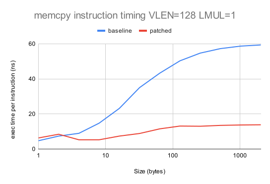
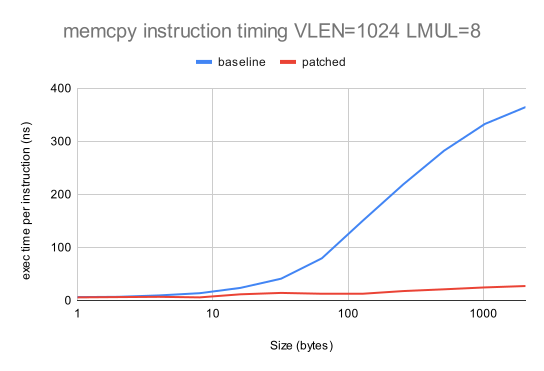
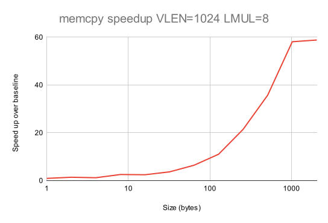
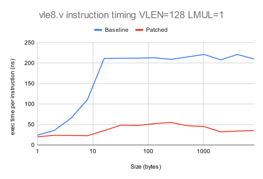
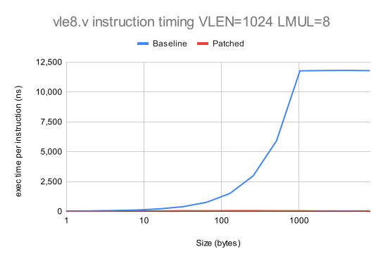
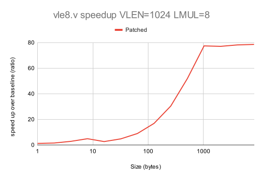
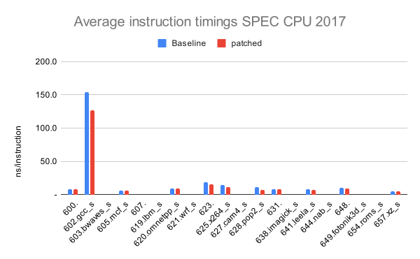
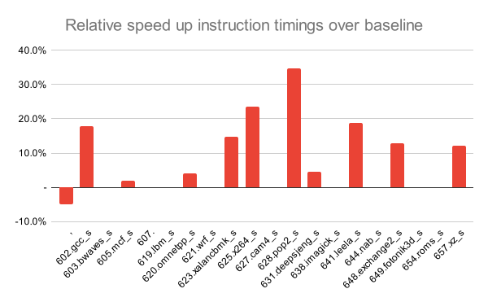

# RISE RP005 QEMU weekly report 2024-07-17

## Overview

We applied a patch in the combined patches that fixed the additonal SPECCPU failures we were seeing.  This patch as been submitted upstream as RFC.  Key results
- `memcpy` up to 60x faster
- SPEC CPU 2017 13% average speed up, with the most vectorized benchmark improved by 35%

## Work completed since last report

- WP2
  - Combined patch using Max Chou's, Hélène Chelin's and Paolo Savini's work submitted as RFC. Ongoing work derived from this:
    - instrumentation of SPEC CPU 2017 to get estimates of the most used vector load/store sizes (technology extensible to other instructions); and
	- investigation into variability in SPEC CPU 2017 scores for 4 benchmarks when the simulator is changed (ongoing).
  - Verified that the use `__builtin_memcpy` triggers vector instructions.
    - AVX instructions are generated (128 bit).
    - We are not getting AVX2 instructions, possibly due compiler tuning, so more work is needed.
  - Submitted a talk on RISE QEMU to the RISC-V Summit.
  - Started to explore optimizations of the calls to `vsetvl`/`vsetvli`.
    - Also looking at the calls from other vector instructions to obtain current `vsetvl`, `vsetvli` state.
    - We aim at avoiding the generation of a function call for every `vsetvl`/`vsetvli` or usage of state in the host code.

## Work planned for the coming two weeks

- WP2
  - Continued analyze of SPEC CPU 2017 as described above.
  - Investigate the GCC tuning needed to enable AVX2 instructions to be materialized for `__builtin_memcpy` and then measure performance.
  - Emulate `vsetvl`/`vsetvli` without calls in the host code.

- WP3
  - Measure performance on AArch64 (lower priority).

# Detailed description of work

## WP2

### Combined patches

We fixed a bug in the HC patches on top of Max's and managed to run the failing SPECCPU tests.  We obtained the expected performance gain on:

- small data sizes: equal or less than 8 bytes per iteration.
- small vectors with no grouping: VLEN=128, LMUL=1.
- large data sizes: more than 8 bytes per iteration.

These optimizations combined with Max's patches achieved
- up to x60 speed-up with the `memcpy` benchmarks; and
- an average 13% speed-up with SPECCPU 2017.

See details below.

### `__builtin_memcpy` analysis

The use of `__builtin_memcpy` results in the introduction of host native vector instructions.  The vector instructions that are generated depend on the compiler flags used to build QEMU.

Here are code snippets introduced by `__builtin_memcpy` for data transfers larged than 64 bytes with different GCC flags to build QEMU:

- default (no flags)
```
movdqu (%rax),%xmm2
mov    %edx,%ebx
movups %xmm2,(%r9)
movdqu 0x10(%rax),%xmm3
movups %xmm3,0x10(%r9)
```
These are SSE2 instructions that move 16 bytes of data and operate on 16 bytes long registers (xmm*).

- `-mno-avx`

```
movdqu (%rax),%xmm2
mov    %edx,%ebx
movups %xmm2,(%r9)
movdqu 0x10(%rax),%xmm3
movups %xmm3,0x10(%r9)
```
Same as the default behavior

- `-mavx`
```
vmovdqu (%r9),%xmm0
mov    %edx,%ebx
vmovdqu %xmm0,(%rax)
vmovdqu 0x10(%r9),%xmm1
vmovdqu %xmm1,0x10(%rax)
```
These are AVX extensions that still operate on 16 bytes chunks of data and 16 bytes registers. Same effect as the SSE2 instructions, so no impact on the performance.

- `-mavx2`
```
vmovdqu (%r9),%xmm0
mov    %edx,%ebx
vmovdqu %xmm0,(%rax)
vmovdqu 0x10(%r9),%xmm1
vmovdqu %xmm1,0x10(%rax)
```
We still get the AVX extension instructions and registers here. This could be due to some GCC tuning needed that influences how `__builtin_memcpy` is built.  This is a matter for ongoing investigation.

There should be cases in which splitting a 256 bit register into two 128 registers and calling twice a 128 bits load or store instead of a sinlge 256 bits load or store can be beneficial. We need to verify that for QEMU.

Next tasks:

- investigate the GCC tuning needed to enable AVX2 instructions to be materialized.
- attempt the direct intriduction of AVX2 instructions through GCC intrinsics (for measurement purposes).

# Statistics

## `memcpy` performance of combined patches + __builtin_memcpy

This is our standard benchmark, which we evaluate for: i) small vectors with `LMUL=1`; and ii) large vectors with `LMUL=8`.  We show the speed-up over the baseline performance with no patch applied.  The full data are in [this Google spreadsheet](https://docs.google.com/spreadsheets/d/1qFc-f5GDjuwTAnO_LKaFz6f8ZQFELjXIBsmlV-K8JYo).

The following two graphs compare the average emulated instruction time of the baseline QEMU with the new patch version of QEMU.

:

:

The following two graphs show the speedup obtained.

:

:

It is worth noting that there are some corner cases where performance is slightly worsened - for data sizes of up to 2 bytes.

## Individual RVV instruction performance

Here is the the performance of `vle8.v`/`vse8.v` for each patch.  The full data are in [this Google spreadsheet](https://docs.google.com/spreadsheets/d/1Md9GtS-R6BT6csd0iHHwnG9hotofzl7-pLmes1a5V44).

The following two graphs compare the performance of the baseline QEMU with the new patch version of QEMU.  We only show data for `vle8.v`, but the results for `vse8.v` are very similar.

:

:

The following two graphs show the speed up over baseline.

:

:

In all cases the performance is improved with the new patch.  We need to understand why, if this is the case, we have a small number of `memcpy` bencmark results showing a slow down.

## SPEC CPU 2017 performance

All benchmarks are compiled using the GCC 14.1 tool chain with rv64gcv as the architecture.  We use the speed benchmarks, which are run using the test datasets.

### SPEC CPU 2017 and combined patches

The latest data are shown in [this Google Spreadsheet](https://docs.google.com/spreadsheets/d/1R4gJ3XFTGuPD6MQgKUpL4vtpwV-a6vr1ON8eU_IAY58)

A total of 11 benchmarks gave reproducible data.  We have excluded benchmarks for the following reasons
- the benchmark recorded an incorrect result at the end of execution
- the benchmark gave differing SPEC CPU results with different versions of the simulator.

The first of these may be due to limitations of the test framework under QEMU.  We have an action to investigate this further.

The second of these may be partly due to natural variability in run-time performance due to analogue components in the behavior.  We have an action to investigate further.

The following graph shows the average QEMU instruction execution time for each benchmark for: i) the baseline QEMU; and ii) the patched QEMU.

:

The following graph shows the speedup over baseline for each benchmark:

:

Key observations.
- All but 1 benchmark (`600.perlbench_s`) are improved by the patch
- Average speedup is 12.7%
- Maximum speedup is 34.7% (`628.pop2_s`)

# Actions

2024-07-03
- **Jeremy**, **Paolo**, **Helene** to share SSH keys with Nathan so that they can have access to a BananaPi board with RVV 1.0.
  - Done.

2024-06-05
- **Paolo** Check behaviour of QEMU with tail bytes.
  - Deferred to prioritize host targeted optimization work.

2024-05-15

- **Jeremy** to look at impact of masked v unmasked and strided v unstrided on vector operations.
  - lower proirity.

2024-05-08

- **Jeremy** to characterise QEMU floating point performance and file it as a performance regression issue in QEMU GitLab.
  - low priority, deferred to prioritize the smoke tests work.

2024-05-01

- **Daniel** to advise **Paolo** on best practice for preparing QEMU upstream submissions.


# Risk register

The risk register is held in a shared [spreadsheet](https://docs.google.com/spreadsheets/d/1mHNwGGGPJ-ls0pgCbvkSdGDoKW4vftzYWeIPPYZYfjY/edit?usp=sharing), which is updated continuously.

There are no changes to the risk register this week.

# Planned absences

Helene will be on vacation from the 29th of July to the 11th of August.
Paolo will be on vacation on the 8th and 9th of August.

# For the record

## The project team
- Paolo Savini (Embecosm)
- Hélène Chelin (Embecosm)
- Jeremy Bennett (Embecosm)
- Hugh O'Keeffe (Ashling)
- Nadim Shehayed (Ashling)
- Daniel Barboza (Ventana)

## Current priorities

Our current set of agreed priorities are as follows

- vector load/store ops for x86_64 AVX
- vector load/store ops for AArch64/Neon
- vector integer ALU ops for x86_64 AVX
- vector load/store ops for Intel AVX10

For each of these there will be an analysis phase and an optimization phase, leading to the following set of work packages.
- WP0: Infrastructure
- WP1: Analysis of vector load/store ops on x86_64 AVX
- WP2: Optimization of vector load/store ops on x86_64 AVX
- WP3: Analysis of vector load/store ops on AArch64/Neon
- WP4: Optimization of vector load/store ops on AArch64/Neon
- WP5: Analysis of integer ALU ops on x86_64 AVX
- WP6: Optimization of integer ALU ops on x86_64 AVX
- WP7: Analysis of vector load/store ops on Intel AVX10
- WP8: Optimization of vector load/store ops on Intel AVX10

These priorities can be revised by agreement with RISE during the project.
