# RISE RP005 QEMU weekly report 2024-07-31

## Work completed since last report

- WP2
  - Continue the analysis of SPEC CPU 2017.
    - deferred to prioritize the work on the patch and on Aarch64.
  - Investigate the GCC tuning needed to enable AVX2 instructions to be materialized for `__builtin_memcpy` and then measure performance.
    - Deferred in order to analyse first the validity of the `__builtin_memcpy` approach with different hosts and endianness.
  - Emulate `vsetvl`/`vsetvli` without calls in the host code.
    - **In progress**: this was slowed down a bit in favour of the analysis of the Aarch64 memcpy timings.

- WP3
  - Measure performance on AArch64
    - The single instruction benchmarks show the expected performance gains of the combined patches.
    - The memcpy benchmark shows a much worse performance regardless of the QEMU version (vanilla or with our patches).
    - The memcpy benchmark shows normal performance with very large data sizes.

## Work planned for the coming two weeks

- WP2
  - Continue the analyze of SPEC CPU 2017.
  - Check the `__builtin_memcpy` for endianness and check its support on Aarch64.
  - Investigate the GCC tuning needed to enable AVX2 instructions to be materialized for `__builtin_memcpy` and then measure performance.
  - Emulate `vsetvl`/`vsetvli` without calls in the host code.

- WP3
  - Investigate the anomalous performance of QEMU on AArch64.

# Detailed description of work

## WP3

## Aarch64 memcpy performance

The memcpy benchmark takes an unrealistic amount of time to complete on Aarch64 for data sizes below 2048 bytes and goes back to a normal execution time for data sizes above 2048 bytes.

These are the memcpy execution time in nanoseconds per instruction performed with the master branch of QEMU (without any of your patches on top). 

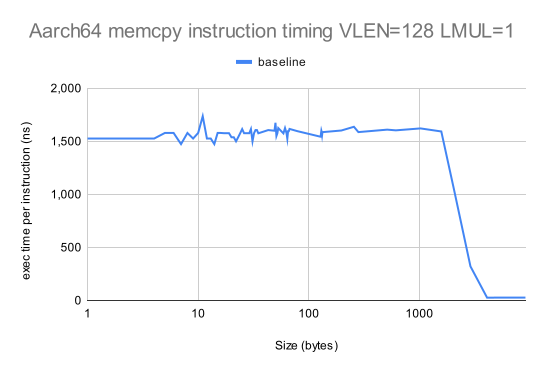

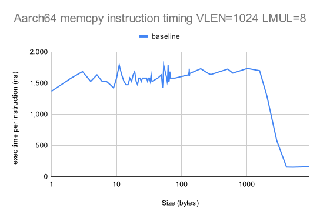

It's possible that the implementation of the memcpy benchmark doesn't agree with QEMU on Aarch64 as the single instruction benchmark (see below), hence the emulation of the single vle8.v instruction yelds the expected execution time.

We'll perform more analyses such as:
- comparing the code executed by QEMU for data sizes above 2048 and below 2048.
- using nanoseconds timers for execution times.

# Statistics

## `memcpy`

Here is the the performance of `vle8.v`.  The full data are in [this Google spreadsheet](https://docs.google.com/spreadsheets/d/1Ryq-q_RCVu_BVcy095HBD97K6yy8HfmHZTWSaUXUJu4/edit?usp=sharing).

This is our standard benchmark, which we evaluate for: i) small vectors with `LMUL=1`; and ii) large vectors with `LMUL=8`.  We show the speed-up over the baseline performance with no patch applied.

## `memcpy` performance on x86

The following two graphs compare the average emulated instruction time of the baseline QEMU with the new patch version of QEMU.

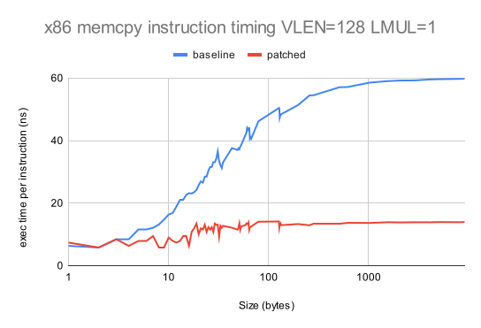

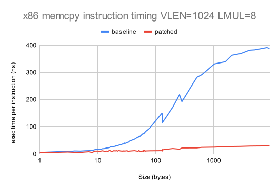

The following two graphs show the speedup obtained.

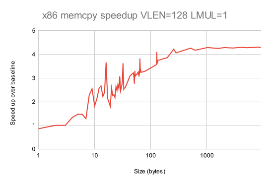

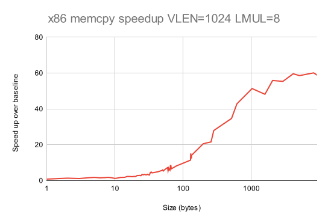

## Individual RVV instruction performance

Here is the the performance of `vle8.v`.  The full data are in [this Google spreadsheet](https://docs.google.com/spreadsheets/d/1t5K3Uy1BX3x4AmlvzHw0yVp62PaBGMVN2Y7HCZ5VWWs/edit?usp=sharing).

## Individual RVV instruction performance on x86

The following two graphs compare the performance of the baseline QEMU with the development branch of QEMU.  We only show data for `vle8.v`, but the results for `vse8.v` are very similar.

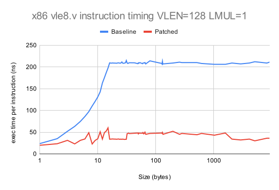

The following two graphs show the speed up over baseline.

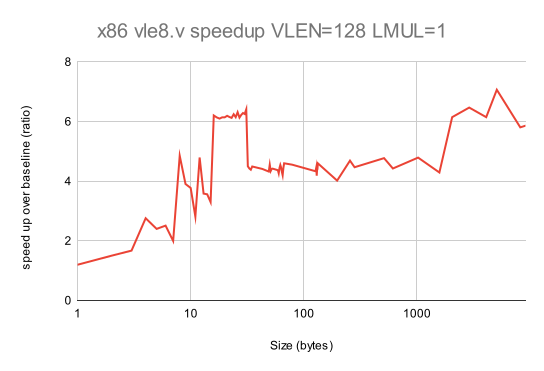

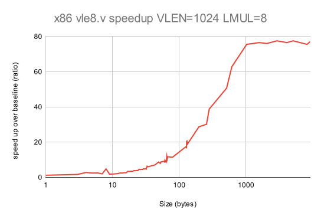

## Individual RVV instruction performance on Aarch64

The following two graphs compare the performance of the baseline QEMU with the development branch of QEMU.  We only show data for `vle8.v`, but the results for `vse8.v` are very similar.

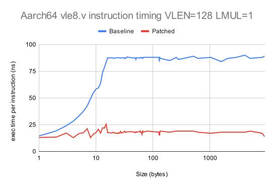

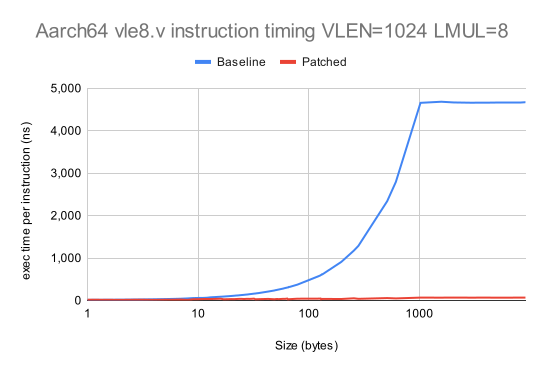

The following two graphs show the speed up over baseline.

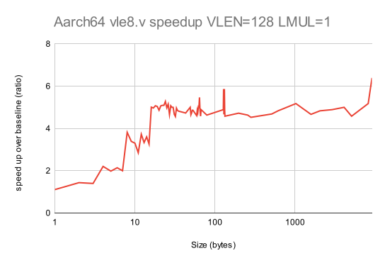

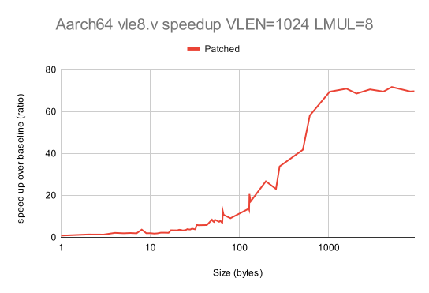

## SPEC CPU 2017 performance

All benchmarks are compiled using the GCC 14.1 tool chain with rv64gcv as the architecture.  We use the speed benchmarks, which are run using the test datasets.

The SPEC CPU 2017 didn't change since last time so we are inserting here the link to the [latest results](https://docs.google.com/spreadsheets/d/1R4gJ3XFTGuPD6MQgKUpL4vtpwV-a6vr1ON8eU_IAY58)

The latest data are shown in [this Google Spreadsheet](https://docs.google.com/spreadsheets/d/1R4gJ3XFTGuPD6MQgKUpL4vtpwV-a6vr1ON8eU_IAY58)

A total of 11 benchmarks gave reproducible data.  We have excluded benchmarks for the following reasons
- the benchmark recorded an incorrect result at the end of execution
- the benchmark gave differing SPEC CPU results with different versions of the simulator.

The first of these may be due to limitations of the test framework under QEMU.  We have an action to investigate this further.

The second of these may be partly due to natural variability in run-time performance due to analogue components in the behavior.  We have an action to investigate further.

The following graph shows the average QEMU instruction execution time for each benchmark for: i) the baseline QEMU; and ii) the patched QEMU.

:

The following graph shows the speedup over baseline for each benchmark:

:

Key observations.
- All but 1 benchmark (`600.perlbench_s`) are improved by the patch
- Average speedup is 12.7%
- Maximum speedup is 34.7% (`628.pop2_s`)

# Actions

2024-07-31
- **Paolo** Open a public repository with Embecosm's benchmarking scripts.
- **Max** Add his SPEC CPU 2017 benchmark scripts to the above mentioned repository, so Embecosm can reproduce his results.
- **Paolo** Create a reference set of statically linked SPEC CPU 2017 binaries to be made available to those who need them.
- **Paolo** Measure the performance of the test [case referenced by Palmer Dabbelt](https://gitlab.com/qemu-project/qemu/-/issues/2137)
- **Paolo** Set up full system emulation. Just timing Linux boot may be sufficient to start with.

2024-07-17
- **Paolo** Update the cover letter to acknowledge the proximity of the code freeze and specify that we aim at the next release.
- **Paolo** Account for regular checks on comments and time required to address feedback on the patch.
  - Review work in progress
- **Paolo**, **Jeremy** breakout of performance of the two contributions for the RISC-V Summit proposal.

2024-06-05
- **Paolo** Check behaviour of QEMU with tail bytes.
  - Deferred to prioritize host targeted optimization work.

2024-05-15

- **Jeremy** to look at impact of masked v unmasked and strided v unstrided on vector operations.
  - lower proirity.

2024-05-08

- **Jeremy** to characterise QEMU floating point performance and file it as a performance regression issue in QEMU GitLab.
  - low priority, deferred to prioritize the smoke tests work.

2024-05-01

- **Daniel** to advise **Paolo** on best practice for preparing QEMU upstream submissions.

# Risk register

The risk register is held in a shared [spreadsheet](https://docs.google.com/spreadsheets/d/1mHNwGGGPJ-ls0pgCbvkSdGDoKW4vftzYWeIPPYZYfjY/edit?usp=sharing), which is updated continuously.

There are no changes to the risk register this week.

# Planned absences

- Helene will be on vacation from the 29th of July to the 11th of August.
- Paolo will be on vacation on:
  - the 8th and the 9th
  - from the 22nd to the 27th of August.

# For the record

## The project team
- Paolo Savini (Embecosm)
- Hélène Chelin (Embecosm)
- Jeremy Bennett (Embecosm)
- Hugh O'Keeffe (Ashling)
- Nadim Shehayed (Ashling)
- Daniel Barboza (Ventana)

## Current priorities

Our current set of agreed priorities are as follows

- vector load/store ops for x86_64 AVX
- vector load/store ops for AArch64/Neon
- vector integer ALU ops for x86_64 AVX
- vector load/store ops for Intel AVX10

For each of these there will be an analysis phase and an optimization phase, leading to the following set of work packages.
- WP0: Infrastructure
- WP1: Analysis of vector load/store ops on x86_64 AVX
- WP2: Optimization of vector load/store ops on x86_64 AVX
- WP3: Analysis of vector load/store ops on AArch64/Neon
- WP4: Optimization of vector load/store ops on AArch64/Neon
- WP5: Analysis of integer ALU ops on x86_64 AVX
- WP6: Optimization of integer ALU ops on x86_64 AVX
- WP7: Analysis of vector load/store ops on Intel AVX10
- WP8: Optimization of vector load/store ops on Intel AVX10

These priorities can be revised by agreement with RISE during the project.

## Attendees at this meeting

- Nathan Egge (Google)
- Paul Walmsley (SiFive)
- Nadim Shehayed (Ashling)
- Paolo Savini (Embecosm)
- Daniel Barboza (Ventana)
- Max Chou (SiFive)
- Jeremy Bennett (Embecosm)

