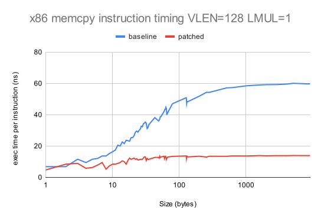
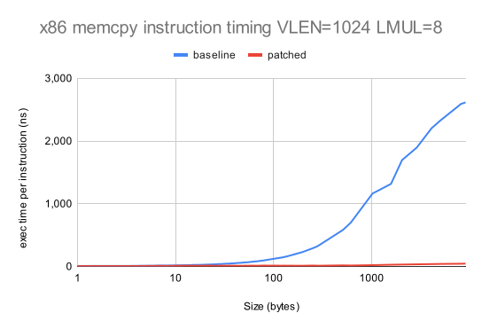
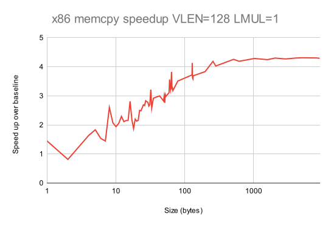
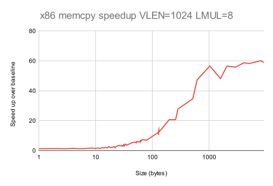
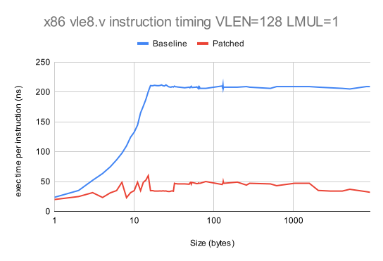
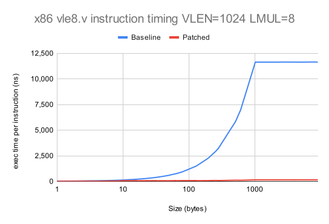
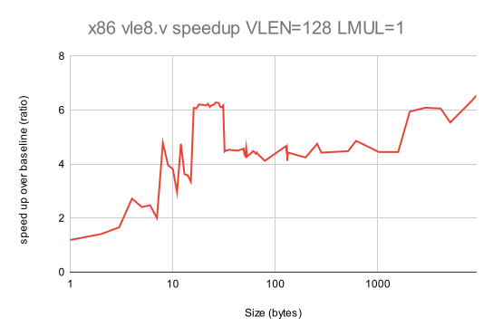
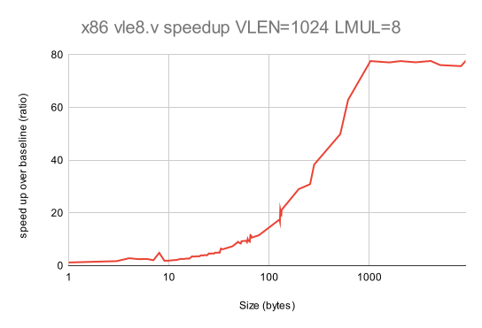
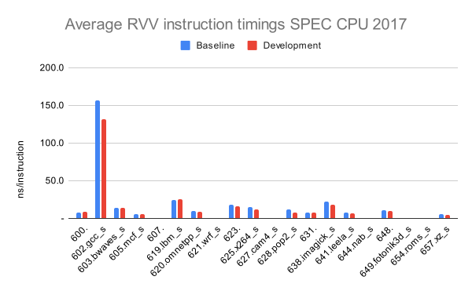
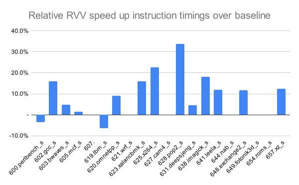

# RISE RP005 QEMU weekly report 2024-08-14

We have fewer updates this week due to vacations.

## Work completed since last report

- WP2
  - Check the `__builtin_memcpy` for endianness and check its support on Aarch64.
    - **In Progress** we are setting up a big-endian environment to test our patches.
  - Emulate `vsetvl`/`vsetvli` without calls in the host code.
    - the original optimization strategy proved to be unpractical.
    - new optimization strategies are being developed for the three different flavours of `vsetvl`/`vsetvli`/`vsetivli`.

## Work planned for the coming two weeks

- WP2
  - Replicate Nathan's results (first priority).
    - investigate this opportunity for more optimizations of `memcpy` operations.
  - Check the `__builtin_memcpy` for endianness and check its support on Aarch64.
  - Investigate the GCC tuning needed to enable AVX2 instructions to be materialized for `__builtin_memcpy` and then measure performance.

- WP3
  - Investigate the anomalous performance of QEMU on AArch64.

# Detailed description of work

## WP2

## Optimization of vset[i]vl[i]

The aim of our optimization is to avoid using a helper function for `vsetvl` instructions as these have a simple functionality to emulate and they are very frequent. If we avoid the use of a helper function we avoid generating function calls in the emulated code.

The original optimization strategy consisted of gathering the parameters passed to `vsetvl`, update the vector configuration and then store it in a data structure shared by the helper functions.

This approach has hit an obstacle: it seems that you can only see the values passed by register to `vsetvl` only once you are in the helper function.
If that is so we can't get in advance all the values we need to update the vector configuration on our own.
This leads us to different strategies according to the `vsetvl` variant we are emulating.

The `vsetvl` variants all take an "application vector length" and a "vector type" configuration parameter and use this to return the new vector length (`vlmax` or the proposed application `vl`) and update the vector configuration:

        vsetvli rd, rs1, vtypei   # rd = new vl, rs1 = AVL, vtypei = new vtype setting
        vsetivli rd, uimm, vtypei # rd = new vl, uimm = AVL, vtypei = new vtype setting
        vsetvl  rd, rs1, rs2      # rd = new vl, rs1 = AVL, rs2 = new vtype value

According to the variant of `vsetvl` used `vl` and `vtype` can be passed either by register or as immediate values.
If an argument is passed as an immediate we can access it straight away and do the calculations we need without the help of a helper function.

In the case of `vsetivli` then we potentially can avoid calling the helper function already.
The `vsetivli` variant though seems quite uncommon so the performance gain might be marginal on large variegate programs like SPEC CPU benchmarks.

The `vsetvli` variant has `vtype` as an immediate argument, so we can perform the new `vtype` configuration directly but has `vl` in a register.
This requires some code generation to emulate what `vsetvli` does with the `vl` argument in order to calculate and return the new `vl`

        set_cc_less_or_eq vl, vlmax
        move_cc rd, vl, vlmax
        
This approach would update the designated destination register with the new `vl` as expected by other vector instructions:

        vsetvli t0, a2, e8, LMUL, ta, ma  // Vectors of supplied LMUL
        vle8.v  v0, (a1)                  // Load bytes
        add     a1, a1, t0                // Bump pointer
        sub     a2, a2, t0                // Decrement count
        vse8.v  v0, (a3)                  // Store bytes
        add     a3, a3, t0                // Bump pointer
        bnez    a2, loop_cpy              // Any more?
        ret

This approach also entails an update of the other helper functions though. The current design of the RVV helper functions relies on the `env` data structure to internally store, update and retrieve the vector configuration. Updating the vector configuration with code generation won't update the internal `env` structure.
We need then to expand the other helper functions to accept an extra argument for the updated `vl` and `vtype`.

Next steps:

- perform a new measurement of the frequency of the `vsetvl` instruction variants in SPEC CPU.
- implement `vsetivli` without helper function.
- implement a prototype of `vsetvli` without helper function.
- measure for performance improvements.
- if the results obtained with `vsetvli` are promising proceed with `vsetvl`.

## Aarch64 memcpy performance

These data refer to the tests run for the previous meeting as we prioritized other work and made no changes to the Aarch64 side yet.

The memcpy benchmark takes an unrealistic amount of time to complete on Aarch64 for data sizes below 2048 bytes and goes back to a normal execution time for data sizes above 2048 bytes.

These are the memcpy execution time in nanoseconds per instruction performed with the master branch of QEMU (without any of your patches on top). 

It's possible that the implementation of the memcpy benchmark doesn't agree with QEMU on Aarch64 as the single instruction benchmark (see below), hence the emulation of the single vle8.v instruction yelds the expected execution time.

We'll perform more analyses such as:
- comparing the code executed by QEMU for data sizes above 2048 and below 2048.
- using nanoseconds timers for execution times.

## Further optimization of memcpy operations

From Nathan's memcpy benchmark it appears that most of the execution time (more than 50%) is still spent in the vector load and store helper function `vext_ldst_us`. This is to be expected from a benchmark focused on memcpy but it also show that in the loop of such helper function there is still potential for more optimization that is crucial for memory vector operations.

Next steps:
- test our patches on Nathan's example.
- identify new possible optimizations in the vector load/store helper functions.

# Statistics

## `memcpy`

Here is the the performance of `vle8.v`.  The full data are in [this Google spreadsheet](https://docs.google.com/spreadsheets/d/1cJS3erYiSzk64EKeo218_NjpbsN52CAT3eHUXFPWt9o/edit?usp=sharing).

This is our standard benchmark, which we evaluate for: i) small vectors with `LMUL=1`; and ii) large vectors with `LMUL=8`.  We show the speed-up over the baseline performance with no patch applied.

## `memcpy` performance on x86

The following two graphs compare the average emulated instruction time of the baseline QEMU with the new patch version of QEMU.

The following two graphs show the speedup obtained.

## Individual RVV instruction performance

Here is the the performance of `vle8.v`.  The full data are in [this Google spreadsheet](https://docs.google.com/spreadsheets/d/1BFU5k_34hei2WZrBoVLzQFTW9XgT39ESFuD6FjY1CqU/edit?usp=sharing).

## Individual RVV instruction performance on x86

The following two graphs compare the performance of the baseline QEMU with the development branch of QEMU.  We only show data for `vle8.v`, but the results for `vse8.v` are very similar.

The following two graphs show the speed up over baseline.

## Individual RVV instruction performance on Aarch64

The following two graphs compare the performance of the baseline QEMU with the development branch of QEMU.  We only show data for `vle8.v`, but the results for `vse8.v` are very similar.
These data refer to the tests run for the previous meeting as we prioritized other work and made no changes to the Aarch64 side yet.

The following two graphs show the speed up over baseline.

## SPEC CPU 2017 Performance

We have updated measurements using the latest QEMU baseline, and our development branch, with Max Chou's, Hélène Chelin's and Paolo Savini's patches.  Overall we see that the patches improve execution time by 11.8% and wall clock time by 12.2% for SPEC CPU speed benchmarks compiled with RVV.  Interestingly the development branch improved performance by 2% when compiled _without_ RVV.

Points to note:

- 5 benchmarks failed to record instruction counts on at least one run;
- 1 benchmark (`607.cactuBSSN_s`) showed > 1% variation in SPEC CPU ratio;
- 8 baseline and 7 development branch benchmarks failed their SPEC CPU checks;
- of the "good" benchmarks, 12 showed an improvement in average instruction time between runs and 2 (`600.perlbench_s` and `619.lbm_s`) showed worse times; and
- 1 benchmark (`602.gcc_s`) shows far higher average instruction times (by a factor of 10) than other benchmarks.

Overall we have trusted data where the SPEC CPU ratios show less than 1% variation between baseline and development branches.

The following graph shows the average instruction execution times for the good benchmarks with RVV for the baseline and development branches

The following graph shows the percentage improvement (degradation in red) in avarage instruction times for the development branch compared to the baseline.

The full data is in this [Google spreadsheet](https://docs.google.com/spreadsheets/d/1R4gJ3XFTGuPD6MQgKUpL4vtpwV-a6vr1ON8eU_IAY58)

# Actions

2024-08-14
- **Paolo** Run Nathan's memcpy benchmark.
- **Jeremy** to put Embecosm's `memcpy` benchmark scripts in the public repository.

2024-07-31
- **Jeremy** Open a public repository with Embecosm's benchmarking scripts.
  - **COMPLETE**.
- **Max** Add his SPEC CPU benchmark scripts to the above mentioned repository, so Embecosm can reproduce his results.
- **Paolo** Create a reference set of statically linked SPEC CPU 2017 binaries to be made available to those who need them.
  - **ON HOLD**. Lower priority.
- **Paolo** Measure the performance of the test [case referenced by Palmer Dabbelt](https://gitlab.com/qemu-project/qemu/-/issues/2137)
  - replaced by checking Nathan's benchmark which is the same benchmark.
- **Paolo** Set up full system emulation. Just timing Linux boot may be sufficient to start with.
  - **ON HOLD** lower priority.

2024-07-17
- **Paolo** Update the cover letter to acknowledge the proximity of the code freeze and specify that we aim at the next release.
  - Superceded.
- **Paolo** Account for regular checks on comments and time required to address feedback on the patch.
  - Review work in progress

2024-06-05
- **Paolo** Check behaviour of QEMU with tail bytes.
  - Deferred to prioritize host targeted optimization work.

2024-05-15

- **Jeremy** to look at impact of masked v unmasked and strided v unstrided on vector operations.
  - lower proirity.

2024-05-08

- **Jeremy** to characterise QEMU floating point performance and file it as a performance regression issue in QEMU GitLab.
  - low priority, deferred to prioritize the smoke tests work.

2024-05-01

- **Daniel** to advise **Paolo** on best practice for preparing QEMU upstream submissions.

# Risk register

The risk register is held in a shared [spreadsheet](https://docs.google.com/spreadsheets/d/1mHNwGGGPJ-ls0pgCbvkSdGDoKW4vftzYWeIPPYZYfjY/edit?usp=sharing), which is updated continuously.

There are no changes to the risk register this week.

# Planned absences

- Paolo will be on vacation on:
  - from the 22nd to the 27th of August.

# For the record

## The project team
- Paolo Savini (Embecosm)
- Hélène Chelin (Embecosm)
- Jeremy Bennett (Embecosm)
- Hugh O'Keeffe (Ashling)
- Nadim Shehayed (Ashling)
- Daniel Barboza (Ventana)

## Current priorities

Our current set of agreed priorities are as follows

- vector load/store ops for x86_64 AVX
- vector load/store ops for AArch64/Neon
- vector integer ALU ops for x86_64 AVX
- vector load/store ops for Intel AVX10

For each of these there will be an analysis phase and an optimization phase, leading to the following set of work packages.
- WP0: Infrastructure
- WP1: Analysis of vector load/store ops on x86_64 AVX
- WP2: Optimization of vector load/store ops on x86_64 AVX
- WP3: Analysis of vector load/store ops on AArch64/Neon
- WP4: Optimization of vector load/store ops on AArch64/Neon
- WP5: Analysis of integer ALU ops on x86_64 AVX
- WP6: Optimization of integer ALU ops on x86_64 AVX
- WP7: Analysis of vector load/store ops on Intel AVX10
- WP8: Optimization of vector load/store ops on Intel AVX10

These priorities can be revised by agreement with RISE during the project.

## Attendees at this meeting

- Nathan Egge (Google)
- Paul Walmsley (SiFive)
- Nadim Shehayed (Ashling)
- Paolo Savini (Embecosm)
- Daniel Barboza (Ventana)
- Max Chou (SiFive)
- Jeremy Bennett (Embecosm)

