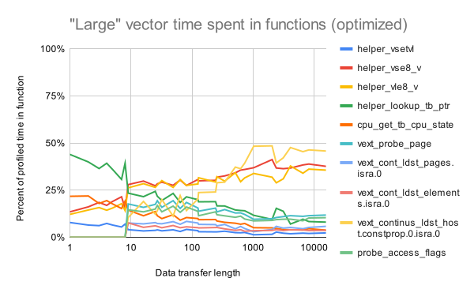

# RISE RP005 QEMU weekly report 2024-08-28

**Note 2024-09-01.** This is a significantly revised report, post the meeting discussion.  In particular the data sets for Linux _perf_ analysis of QEMU with optimizations applied were incorrect.

We have fewer updates this week due to vacations.

## Work completed since last report

- WP2
  - Replicate Nathan's results:
    - **In Progress** Initial results and analysis;
	- load/store functions are important in `memcpy`, even after optimization; and
	- other functions, notably those involved with `TranslationBlock` handling, are much more significant after optimization patches are applied.
  - Profile SPEC CPU 2017 using optimized QEMU:
    - initial result for `628.pop2_s`; and
	- Key finding is that vector load store dominates when unoptimized, but once optimized, `TranslationBlock` handling is the most significant functionality.
- Other
  - Max Chou's talk was accepted for RISC-V NA Summit.
    - Congratulations to Max
	- Max has invited Jeremy Bennett to be co-author

## Work planned for the coming two weeks

- WP2
  - Repeat the Linux _perf_ analysis with version 5 of Max Chou's patch
  - Investigate optimization of `TranslationBlock` access functions.
  - Check the `__builtin_memcpy` for endianness and check its support on Aarch64.
  - Investigate the GCC tuning needed to enable AVX2 instructions to be materialized for `__builtin_memcpy` and then measure performance.

- WP3
  - Investigate the anomalous performance of QEMU on AArch64.

# Detailed description of work

## WP2

All the data used here is in a [Google spreadsheet](https://docs.google.com/spreadsheets/d/1Wg50RgQk2lPIWluirn3bvlVfKTxYumLtOSC06m74CHg).

### Analysis of the bionic benchmark

This benchmark is almost identical to the benchmark we have used from the start of the project.  The implementation of `memcpy` is almost identical to the reference implementation in the RVV standard, with two changes (aside from cosmetic layout):

- the instructions decrementing the count and incrementing the pointer are swapped (they are independent); and
- the choice of registers is different.

The two are shown here side by side

```
bionic_memcpy:                           vmemcpy:
        mv      a4, a0                           mv      a3, a0
loop:                                    loop_cpy:
        vsetvli a3, a2, e8, LMUL, ta, ma         vsetvli t0, a2, e8, LMUL, ta, ma
        vle8.v  v0, (a1)                         vle8.v  v0, (a1)
        sub     a2, a2, a3                       add     a1, a1, t0
        add     a1, a1, a3                       sub     a2, a2, t0
        vse8.v  v0, (a4)                         vse8.v  v0, (a3)
        add     a4, a4, a3                       add     a3, a3, t0
        bnez    a2, loop                         bnez    a2, loop_cpy
        ret                                      ret
```

### Methodology for performance profiling of memory benchmark

We have used Linux _perf_ to analyze QEMU running the memory benchmark under a range of scenarios.  To record the profile (in this case for VLEN=1024, LMUL=8 and a block size for the copy of 8192) we used:
```
perf record -g -m 16M --call-graph dwarf,4096 \
    qemu-riscv64 -cpu rv64,v=true,vlen=1024 vmemcpy8.exe 8192 10000
```
Unlike with our regular benchmarks, the number of iterations varies, with larger values used with the smaller block sizes, to ensure we get sufficient samples from _perf_ to be statistically significant.

The default method of determining the call graph, using the frame pointer is unreliable with optimized code, since the frame pointer may be missing.  We use the safer (but _much_ slower) approach of determining the call graph from the DWARF debug information in the binary.  This means we must build QEMU using the `-g` option to GDB.

The data was then recorded as a tree using:
```
perf report --stdio --call-graph "graph,0.1,caller,function" \
    -k /tmp/vmlinux
```

**Note.** Collection of data on Linux systems is usually disabled by default.  To resolve kernel symbols, an uncompressed kernel image is required.  So to enabled collection with kernel symbols on Ubuntu 24.04 we used:
```
# /usr/src/linux-headers-5.15.0-58/scripts/extract-vmlinux /vmlinuz \
    > /tmp/vmlinux
# echo -1 > /proc/sys/kernel/perf_event_paranoid
# echo 0 > /proc/sys/kernel/kptr_restrict
```

In addition, QEMU is built with plugins disabled and with the GCC `-g` flag, so that DWARF debugging information is available.  This allows symbols to be identified while profiling.

Scripts were then used to break out the key data.  At the top level, we can just look at the time spent in each function.  We look at the total time for the function and all its children (the functions it calls) and also the time just due to the function itself.  The following tables is running vector `memcpy` with VLEN=1024, LMUL=8 and a data block size of 15,625 bytes on the baseline version of QEMU (i.e. without the recent patches from Max Chou, Hélène Chelin and Paolo Savini.

| Children |     Self | Function/address                         |
| -------: | -------: | :--------------------------------------- |
|    93.99 |    68.41 | `vext_ldst_us`                           |
|    49.33 |     0.02 | `helper_vle8_v`                          |
|    43.34 |     0.03 | `helper_vse8_v`                          |
|    18.13 |    13.25 | `lde_b`                                  |
|     6.19 |     6.19 | `cpu_stb_data_ra`                        |
|     6.00 |     5.99 | `cpu_ldsb_data_ra`                       |
|     5.20 |     5.20 | `ste_b`                                  |

As expected, the greatest amount of time is spend in the generic RISC-V vector load/store function.  Lesser amounts of time are spent in the generic functions to load and store bytes and in the generic functions to access raw addresses.  Note also that `helper_vle8_v` and `helper_vse8_v`, are primarily wrapper functions, with little of their own computation.

In general, we are going to focus on the functions, with high values in the "Self" column, since these are the best targets for optimization.

The files generated by `perf report` have more fine grain detail, useful when trying to understand individual functions.  One advantage of using DWARF to map the call-flow graph is that we can identify inlined functions.  This will be the subject of future work, but is not considered further in this report.

All the scripts used here are in the public [`rise-rvv-tcg-qemu-tooling`](https://github.com/embecosm/rise-rvv-tcg-qemu-tooling) repository in the [`memcpy-benchmarks`](https://github.com/embecosm/rise-rvv-tcg-qemu-tooling/tree/main/memcpy-benchmarks) directory.  The [README](https://github.com/embecosm/rise-rvv-tcg-qemu-tooling/blob/main/memcpy-benchmarks/README.md) gives details of how they are used.

### Performance profiling of memory benchmark: most important functions

The starting point with this data is to look at the functions which consume the most processing time.  This will vary from a number of factors:
- the size of the data blocks being copied;
- the values of LMUL and VLEN;
- whether we have applied the optimizations from Max Chou, Hélène Chelin and Paolo Savini.

We compared two hardware scenarios for RVV: the "small" configuration (VLEN=128, LMUL=1) and the "large" configuration (VLEN=1024, LMUL=8).  We also profiled a scalar implementation for comparison.

We looked at 31 different data block sizes when copying from 1 byte through to 15,625 bytes.

#### "Small" (VLEN=128, LMUL=1) configuration

Our first measurements looks at which functions account for more than 1% of the processing in the runs.  The following table is for the "small" configuration (VLEN=128, LMUL=1) with no optimizations applied.  The count shows in how many runs that function and its children accounted for more than 1% of the total execution time.

| Count | Function/address                              |
| ----: | :------------------------------------------   |
|    31 | `vext_ldst_us`                                |
|    31 | `lde_b`                                       |
|    31 | `helper_vsetvl`                               |
|    31 | `helper_lookup_tb_ptr`                        |
|    31 | `cpu_get_tb_cpu_state`                        |
|    30 | `ste_b`                                       |
|    30 | `cpu_stb_data_ra`                             |
|    30 | `cpu_ldsb_data_ra`                            |
|     9 | `helper_vle8_v`                               |
|     5 | `tb_htable_lookup`                            |
|     5 | `qht_lookup_custom`                           |
|     5 | `helper_vse8_v`                               |
|     3 | `tb_lookup_cmp`                               |
|     3 | `interval_tree_subtree_search`                |
|     2 | `page_get_flags`                              |
|     2 | `get_page_addr_code_hostp`                    |

We can see that 5 functions are common to all runs, 3 more are in all but 1, and the rest are less frequent.  Of these common functions, we need to see which consume the most time, and are hence the best targets for optimization.


This shows how execution time is dominated by `vext_ldst_us`, particularly for large data block sizes.  It is the obvious target for optimization.

For smaller data block sizes, the functions to access the `TranslationBlock` (medium term state) are important, but become less important for larger blocks.  The `TranslationBlock` holds information about the vector operations set up by instructions like `vsetvli`, and needs to be consulted for most vector instructions.  When data block sizes are large, this is relatively less significant.  This explains why `helper_vsetvl` is also prominent for small data sizes.

The optimizations by Max Chou, Hélène Chelin and Paolo Savini focus on `vext_ldst_us`.  We can see the effect of this when we repeat the measurements for QEMU with these optimizations applied.

| Count | Function/address                              |
| ----: | :------------------------------------------   |
|    31 | `vext_set_tail_elems_1s`                      |
|    31 | `helper_vsetvl`                               |
|    31 | `helper_vse8_v`                               |
|    31 | `helper_vle8_v`                               |
|    31 | `helper_lookup_tb_ptr`                        |
|    31 | `cpu_get_tb_cpu_state`                        |
|    30 | `cpu_mmu_lookup`                              |
|    25 | `store_atom_8`                                |
|    25 | `cpu_stq_le_data_ra`                          |
|    25 | `cpu_ldq_mmu`                                 |
|    10 | `cpu_ldq_le_data_ra`                          |
|     7 | `tb_htable_lookup`                            |
|     7 | `qht_lookup_custom`                           |
|     5 | `tb_lookup_cmp`                               |
|     5 | `interval_tree_subtree_search`                |
|     5 | `get_page_addr_code_hostp`                    |
|     4 | `page_get_flags`                              |
|     4 | `do_st2_mmu`                                  |
|     3 | `do_ld4_mmu.constprop.0`                      |
|     3 | `do_ld2_mmu.constprop.0`                      |
|     3 | `cpu_stl_mmu`                                 |
|     3 | `cpu_lduw_le_data_ra`                         |
|     1 | `cpu_stb_data_ra`                             |
|     1 | `0x00007f81e40a2b6e`                          |

We see a larger set of functions sharing the workload, which is what you would expect when a dominant function is optimized.  Note in particular that `vext_ldst_us` is no longer listed.  This is partly because the function has been well optimized, but also because the optimized function is amenable to inlining in its calling functions (`helper_vse8_v` and `helper_vle8_v`), which now do appear in the list.

The graph of trends tells us more


We see that no one function dominates.  There is still scope for optimization of `vext_ldst_us`, which now shows as inlined in `helper_vle8_v` and `helper_vse8_v`.  Between them these account for between 26% and 52% of the execution time.

However `TranslationBlock` functions are now prominent, and thus targets for future optimization, notably `helper_lookup_tb_ptr`, `cpu_get_tb_cpu_state` and `helper_vsetvl`.

#### "Large" (VLEN=1024, LMUL=8) configuration

We repeat the analysis for the large configuration.  For the unoptimized QEMU we again have a relatively small set of functions.

| Count | Function/address                              |
| ----: | :------------------------------------------   |
|    31 | `vext_ldst_us`                                |
|    31 | `lde_b`                                       |
|    30 | `ste_b`                                       |
|    30 | `cpu_stb_data_ra`                             |
|    30 | `cpu_ldsb_data_ra`                            |
|    17 | `helper_lookup_tb_ptr`                        |
|    17 | `cpu_get_tb_cpu_state`                        |
|    12 | `helper_vsetvl`                               |
|     8 | `helper_vle8_v`                               |
|     7 | `helper_vse8_v`                               |

The graph shows that `vext_ldst_us` is even more prominent.


When we look at the optimized code, we again see the work is spread across more functions as expected.

| Count | Function/address                              |
| ----: | :------------------------------------------   |
|    31 | `helper_vsetvl`                               |
|    31 | `helper_vse8_v`                               |
|    31 | `helper_vle8_v`                               |
|    31 | `helper_lookup_tb_ptr`                        |
|    31 | `cpu_get_tb_cpu_state`                        |
|    24 | `vext_probe_page`                             |
|    24 | `vext_cont_ldst_pages.isra.0`                 |
|    24 | `vext_cont_ldst_elements.isra.0`              |
|    24 | `vext_continus_ldst_host.constprop.0.isra.0`  |
|    24 | `probe_access_flags`                          |
|    24 | `page_get_flags`                              |
|    24 | `interval_tree_subtree_search`                |
|    17 | `interval_tree_iter_first`                    |
|     8 | `liveness_pass_1`                             |
|     7 | `vext_set_tail_elems_1s`                      |
|     6 | `ste_b_host`                                  |
|     6 | `lde_b_host`                                  |
|     6 | `cpu_mmu_lookup`                              |
|     3 | `do_st2_mmu`                                  |
|     3 | `do_ld4_mmu.constprop.0`                      |
|     3 | `do_ld2_mmu.constprop.0`                      |
|     3 | `cpu_stl_mmu`                                 |
|     3 | `cpu_lduw_le_data_ra`                         |
|     2 | `tb_htable_lookup`                            |
|     2 | `qht_lookup_custom`                           |
|     1 | `tb_lookup_cmp`                               |
|     1 | `store_atom_8`                                |
|     1 | `cpu_stq_le_data_ra`                          |
|     1 | `cpu_stb_data_ra`                             |
|     1 | `cpu_ldq_mmu`                                 |
|     1 | `0x00007fc32c0a2b6e`                          |

We see that the GCC IPA SRA (inter-procedural scalar replacement of aggregates) optimization pass is having an effect on `vext_const_ldst`, generating some optimized functions.  The graphs tells us more.



Again we see a rise in prominence of `TranslationBlock` functions, particularly for the smaller sizes.  However there is also a significant compute effort from functions derived from `vext_ldst_us`, particularly with large data sizes (`helper_vse8_v`, `helper_vle8_v`, `vext_continus_ldst_host.constprop.0.isra.0`).  However the figures need a little interpretation, since they appear to account for around 150% of all compute.  Linux `perf` is double counting inlined functions, which can be seen by looking at the detailed report.  However for the biggest functions, this is probably still accounting for 75% of the total compute, and therefore worth further targeting for optimization.

#### Scalar memcpy

It is worth just noting how the vector data compares with the original scalar memcpy function.  It doesn't matter whether we look at unoptimized or optimized code, we see that there are just two functions which appear in multiple runs.

| Count | Function/address                              |
| ----: | :------------------------------------------   |
|    25 | `cpu_get_tb_cpu_state`                        |
|    24 | `helper_lookup_tb_ptr`                        |
|     1 | `0x00007feff40a3987`                          |
|     1 | `0x00007feff40a3962`                          |
|     1 | `0x00007feff40a3940`                          |
|   ... | <700+ more lines>                              |

Almost all the code is JITed basic blocks (which will be different for each run).  The two functions which appear multiple times (`cpu_get_tb_cpu_state` and `helper_lookup_tb_ptr`) are both associated with accessing the `TranslationBlock`.

As the graph shows, their importance tails off as we use large data block sizes.


### Performance profiling of `628.pop2_s`

We have chosen the SPEC CPU 2017 benchmarks which shows the largest benefit from the vector `memcpy` optimization.  The goal is to understand the potential for further gains from optimizing `memcpy`.  The benchmark was run on the default QEMU vector configuration (VLEN=128).

First we look at unoptimized QEMU.

| Children |     Self | Function/address                              |
| -------: | -------: | :-------------------------------------------- |
|    45.72 |    31.82 | `vext_ldst_us`                                |
|     5.88 |     5.87 | `cpu_get_tb_cpu_state`                        |
|    11.60 |     5.73 | `helper_lookup_tb_ptr`                        |
|     6.59 |     4.77 | `lde_b`                                       |
|     2.59 |     2.58 | `helper_vsetvl`                               |
|     2.47 |     2.40 | `float64_muladd`                              |
|     2.30 |     2.23 | `cpu_stb_data_ra`                             |
|     2.19 |     2.14 | `cpu_ldsb_data_ra`                            |
|     1.92 |     1.92 | `ste_b`                                       |
|     1.82 |     1.82 | `do_ld4_mmu.constprop.0`                      |
|     1.52 |     1.52 | `cpu_mmu_lookup`                              |
|     1.54 |     1.26 | `vext_ldst_stride`                            |
|     1.65 |     1.22 | `cpu_ldq_mmu`                                 |

We see that in this benchmark, handling vector load/store accounts for 32% of the execution time, and helps to explain why the `memcpy` optimizations were so effective.

These are the results using QEMU with the optimizations from Max Chou, Hélène Chelin and Paolo Savini.

| Children |     Self | Function/address                              |
| -------: | -------: | :-------------------------------------------- |
|    10.72 |    10.71 | `cpu_get_tb_cpu_state`                        |
|    19.14 |     8.39 | `helper_lookup_tb_ptr`                        |
|     4.22 |     4.21 | `helper_vsetvl`                               |
|     3.64 |     3.52 | `float64_muladd`                              |
|     4.33 |     2.71 | `helper_vle64_v`                              |
|     3.23 |     2.46 | `cpu_ldq_mmu`                                 |
|     4.04 |     2.22 | `helper_vse64_v`                              |
|     2.07 |     2.07 | `vext_continus_ldst_host.constprop.0.isra.0`  |
|     2.52 |     2.04 | `vext_ldst_stride`                            |
|     2.02 |     2.02 | `vext_set_tail_elems_1s`                      |
|     1.78 |     1.78 | `cpu_mmu_lookup`                              |
|     2.82 |     1.42 | `cpu_stq_le_data_ra`                          |
|     2.41 |     1.37 | `helper_vlxei64_32_v`                         |
|     2.00 |     1.34 | `helper_vle32_v`                              |
|     3.91 |     1.32 | `helper_vse8_v`                               |
|     1.32 |     1.32 | `do_ld4_mmu.constprop.0`                      |
|     1.28 |     1.28 | `float64_mul`                                 |
|     3.76 |     1.13 | `helper_vle8_v`                               |
|     1.33 |     1.08 | `store_atom_8`                                |

We see that the amount of time spent in vector load/store is greatly reduced, and once again the most prominent functions are those associated with `TranslationBlock` lookup.

# Statistics

There are no new statistics, beyond those reported above.

# Actions

2024-08-14
- **Paolo** Run Nathan's memcpy benchmark.
  - **COMPLETE** See above.
- **Jeremy** to put Embecosm's `memcpy` benchmark scripts in the public repository.
  - **COMPLETE** See commit [#ccc9dd1](https://github.com/embecosm/rise-rvv-tcg-qemu-tooling/commit/ccc9dd11d5e1c89b9303715f35e0976286c2586e) in the [`rise-rvv-tcg-qemu-tooling`](https://github.com/embecosm/rise-rvv-tcg-qemu-tooling) repository.  This includes the ability to run the Bionic variant and the ability to run Linux _perf_ on benchmarks.

2024-07-31
- **Max** Add his SPEC CPU benchmark scripts to the above mentioned repository, so Embecosm can reproduce his results.
- **Paolo** Create a reference set of statically linked SPEC CPU 2017 binaries to be made available to those who need them.
  - **ON HOLD**. Lower priority.
- **Paolo** Set up full system emulation. Just timing Linux boot may be sufficient to start with.
  - **ON HOLD** lower priority.

2024-07-17
- **Paolo** Account for regular checks on comments and time required to address feedback on the patch.
  - Review work in progress

2024-06-05
- **Paolo** Check behavior of QEMU with tail bytes.
  - Deferred to prioritize host targeted optimization work.

2024-05-15

- **Jeremy** to look at impact of masked v unmasked and strided v unstrided on vector operations.
  - lower priority.

2024-05-08

- **Jeremy** to characterize QEMU floating point performance and file it as a performance regression issue in QEMU GitLab.
  - low priority, deferred to prioritize the smoke tests work.

# Risk register

The risk register is held in a shared [spreadsheet](https://docs.google.com/spreadsheets/d/1mHNwGGGPJ-ls0pgCbvkSdGDoKW4vftzYWeIPPYZYfjY/edit?usp=sharing), which is updated continuously.

There are no changes to the risk register this week.

# Planned absences

- Jeremy Bennett will be away at conferences 12-16 September
  - includes GNU Tools Cauldron 14-16 September
- Paolo Savini will be on vacation 20-24 and 27 September

# For the record

## The project team
- Paolo Savini (Embecosm)
- Hélène Chelin (Embecosm)
- Jeremy Bennett (Embecosm)
- Hugh O'Keeffe (Ashling)
- Nadim Shehayed (Ashling)
- Daniel Barboza (Ventana)

## Current priorities

Our current set of agreed priorities are as follows

- vector load/store ops for x86_64 AVX
- vector load/store ops for AArch64/Neon
- vector integer ALU ops for x86_64 AVX
- vector load/store ops for Intel AVX10

For each of these there will be an analysis phase and an optimization phase, leading to the following set of work packages.
- WP0: Infrastructure
- WP1: Analysis of vector load/store ops on x86_64 AVX
- WP2: Optimization of vector load/store ops on x86_64 AVX
- WP3: Analysis of vector load/store ops on AArch64/Neon
- WP4: Optimization of vector load/store ops on AArch64/Neon
- WP5: Analysis of integer ALU ops on x86_64 AVX
- WP6: Optimization of integer ALU ops on x86_64 AVX
- WP7: Analysis of vector load/store ops on Intel AVX10
- WP8: Optimization of vector load/store ops on Intel AVX10

These priorities can be revised by agreement with RISE during the project.
