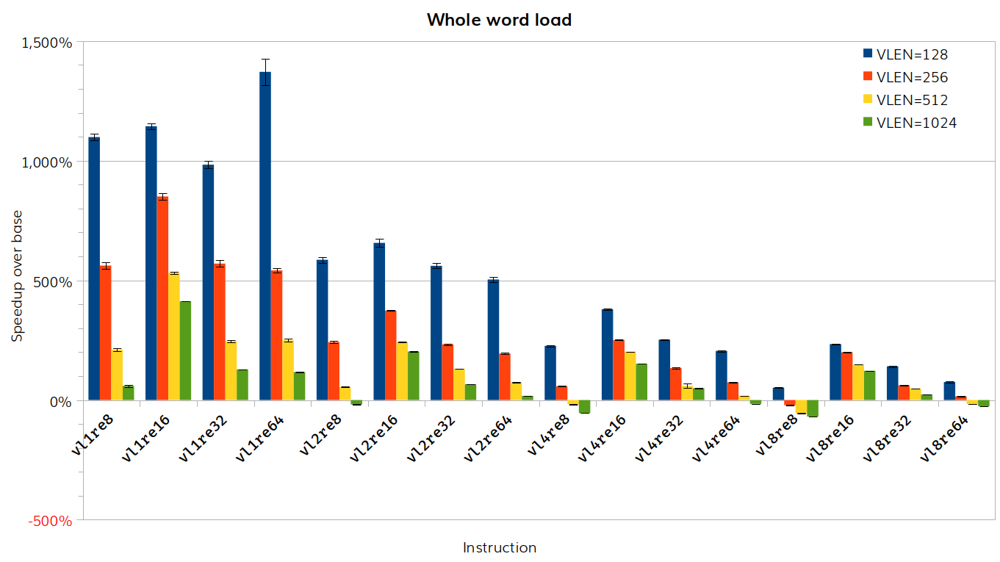
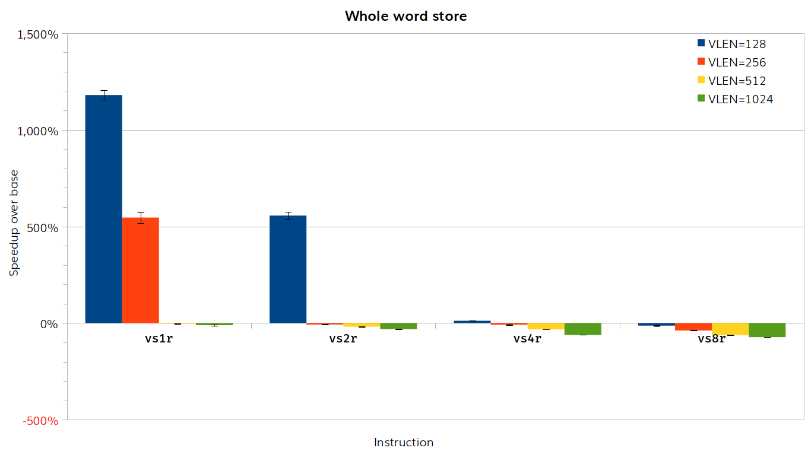

# RISE RP005 QEMU weekly report 2025-01-15

## Milestone 2

- Patch 1 (small vectors unit stride loads/stores).
  - **COMPLETE.**

- Patch 2 (large vectors unit stride loads/stores).
  - Minor fixes posted to address [Richard Henderson's review](https://lists.gnu.org/archive/html/qemu-devel/2025-01/msg01147.html).
  - [Updated patch](https://lists.gnu.org/archive/html/qemu-devel/2025-01/msg01332.html), no further responses.

## Milestone 3

Generate TCG Ops for vector whole word load/store.
- **IN PROGRESS**.
  - [Latest version of the patch](https://github.com/PaoloS02/rise-rvv-tcg-qemu/commit/db95037b428e28b084ce550872406da9ba4217bf).
  - Performance improvement for all except large data with large vectors.
  - We are identifying the cut-off point, so we use helper functions in this case, and will then submit the final version of the patch.
  - Key limit to performance is maintaining the `vstart` CSR.

- Improve first-fault handling for vector load/store helper functions.
  - **IN PROGRESS**.
  - No new work to report this week.

- Improve strided load/store helper functions.
  - **IN PROGRESS**.
  - No new work to report this week.

## Statistics

### Instruction timing for TCGOp generation for whole word load/store

We used a simple assembler benchmark to obtain timings for each instruction and hence for each instruction the speedup from TCGOp generation.  The graphs show the results of 10 separate runs, with standard error bars.

### SiFive benchmarks: TCGOp generation for memcpy (V3)

This uses the variant implementation of `memcpy` using whole word load/store (see the [report from 18 Dec 2024](https://github.com/embecosm/rise-rvv-tcg-qemu-reports/blob/main/20241218.md). There is no update from [last week's report](strmem-reports/report-2025-01-08-12-58-14.pdf)

## Actions

## Other

Next meeting 22 January 2025.
