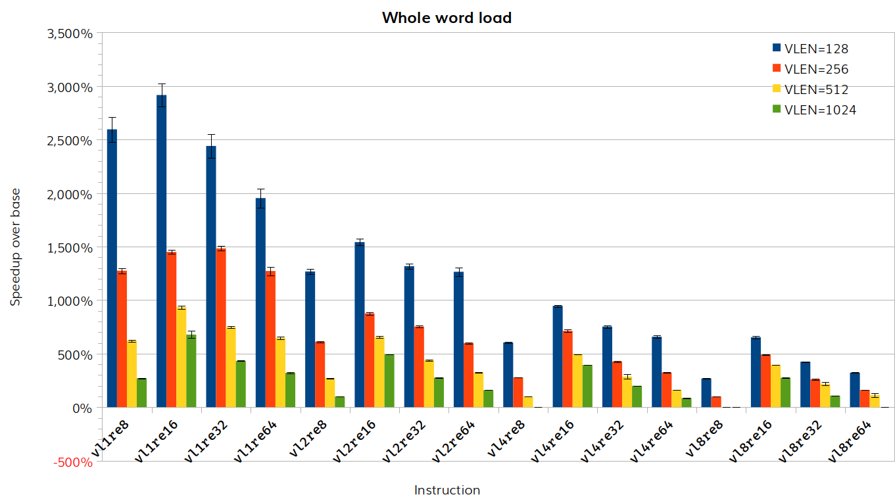
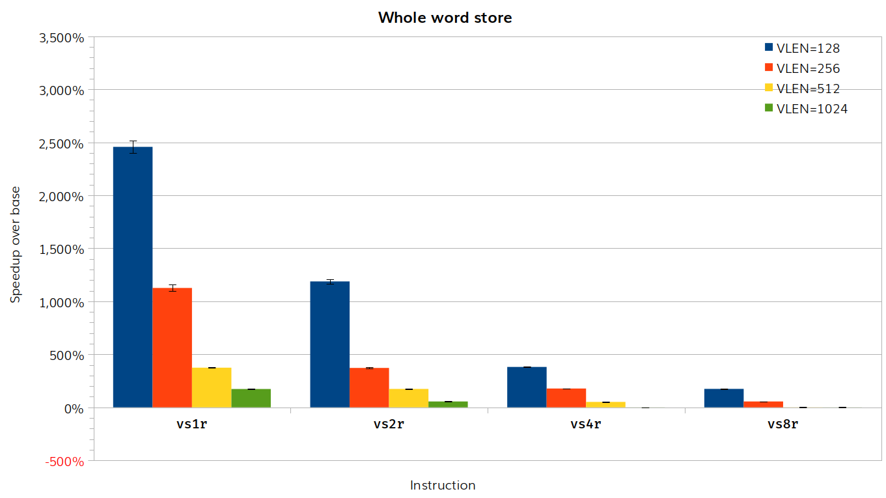

# RISE RP005 QEMU weekly report 2025-01-22

## Milestone 2

- Patch 1 (small vectors unit stride loads/stores).
  - **COMPLETE.**

- Patch 2 (large vectors unit stride loads/stores).
  - **COMPLETE.**

## Milestone 3

- Generate TCG Ops for vector whole word load/store.
  - **IN PROGRESS**.
    - Cut-off points for which helper functions has been completed and a new [patch submitted](https://lore.kernel.org/all/20250122164905.13615-1-paolo.savini@embecosm.com/).
	- Benchmarking shows up to 30x speed up for load and 25x speed up for store depending on instruction and vector length, with no slow downs.
    - See analysis below on how `vstart` is maintained.

- Improve fault-only-first handling for vector load helper functions.
  - **IN PROGRESS**.
  - We are working on benchmarks to measure the performance of the fault-only-first load instructions.

- Improve strided load/store helper functions.
  - **IN PROGRESS**.
  - No new work to report this week.

## Detailed analysis

### Whole word load/store and `vstart`

The speed up is partly obtained by using instructions which transfer more than one element at a time (typically 64 bits). These instructions are naturally atomic, in the sense that they either do the whole transfer, or none of the transfer. This means that exceptions and asynchronous interrupts can only be taken at the boundaries of such instructions.  Thus `vstart` for byte sized elements will only ever take the values 0, 8, 16, ...

The point of `vstart` is to allow clean restart of vector load/store instructions, with its behavior specified in section 3.7 of the RISC-V Vector standard version 1.0.  There is no requirement that exceptions/interrupts must be capable of being taken at every element.  Indeed there is no requirement that vector load/store even be interruptible.  The standard implicitly recognizes that implementations may not generate all possible `vstart` values.

>Implementations are permitted to raise illegal instruction exceptions when attempting to execute a vector instruction with a value of `vstart` that the implementation can never produce.

Max Chou's test checks that executing `vs8r.v` sets `vstart` to the element that crossed a page boundary into a protected memory region (specifically, element 15).  The TCGOp implementation would set `vstart=8` unless falling back to the helper function, when it would still set `vstart=15`.  These are both correct behavior, indicating which element to use when restarting the instruction.

## Statistics

### Instruction timing for vector whole word load/store

- Baseline commit: d6430c17d7
- Test commit: 514712038a

### Instruction timing for fault-only-first load

An initial framework for benchmarking fault-only-first load is under development. We are currently running baseline benchmark tests to validate the technique for unmasked loads.  We will later run benchmarks with various masks for comparison.

## Actions

## Other

Next meeting 29 January 2025.
