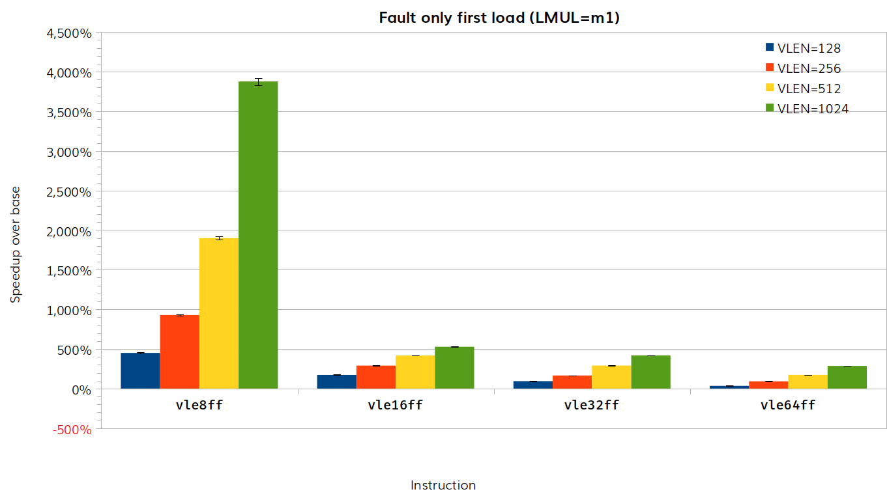
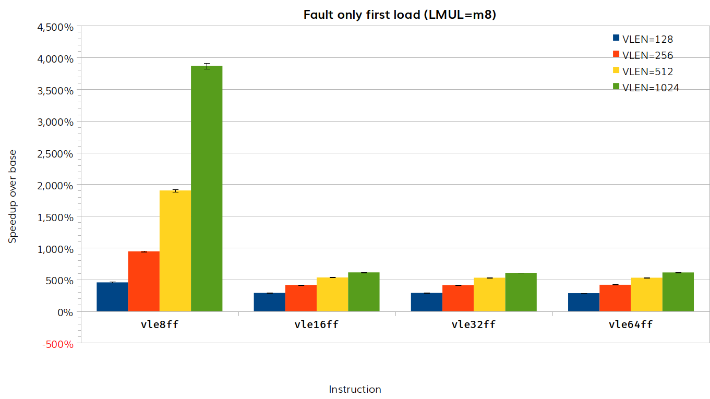

# RISE RP005 QEMU weekly report 2025-01-29

## Milestone 2

**COMPLETE.**

## Milestone 3

- Generate TCG Ops for vector whole word load/store.
  - **IN PROGRESS**.
  - [Patch](https://lore.kernel.org/all/20250122164905.13615-1-paolo.savini@embecosm.com/) under review.
  - Some push back on the front end selecting whether to use TCGOp generation or helper function.

- Improve fault-only-first handling for vector load helper functions.
  - **IN PROGRESS**.
  - [patch](https://lore.kernel.org/all/20250129144435.82451-1-paolo.savini@embecosm.com/) submitted for review.
  - The approach is to do a mass probe for a fault rather than element-by-element inspection. Only in the event of a fault do we then use the element-by-element approach to locate the fault. This makes the common scenario (no fault) much faster.
  - Results show up to 40x speedup, depending on VLEN, LMUL and element size, with no scenarios showing a slow down.

- Improve strided load/store helper functions.
  - **IN PROGRESS**.
  - No new work to report this week.

## Statistics

### Instruction timing for fault only first load

- Baseline commit: 32a97c5d05
- Test commit: 8c21132002

For clarity we show separate results for each value of LMUL.  The results vary depending on LMUL, VLEN and element size.  We present here the data for LMUL=m1 and LMUL=m8, the results for m2 and m4 are intermediate.

The benchmark scripts can be found in the `fault-first-load` directory of the [tooling repository]()

## Actions

## Other

Next meeting 5 February 2025.
