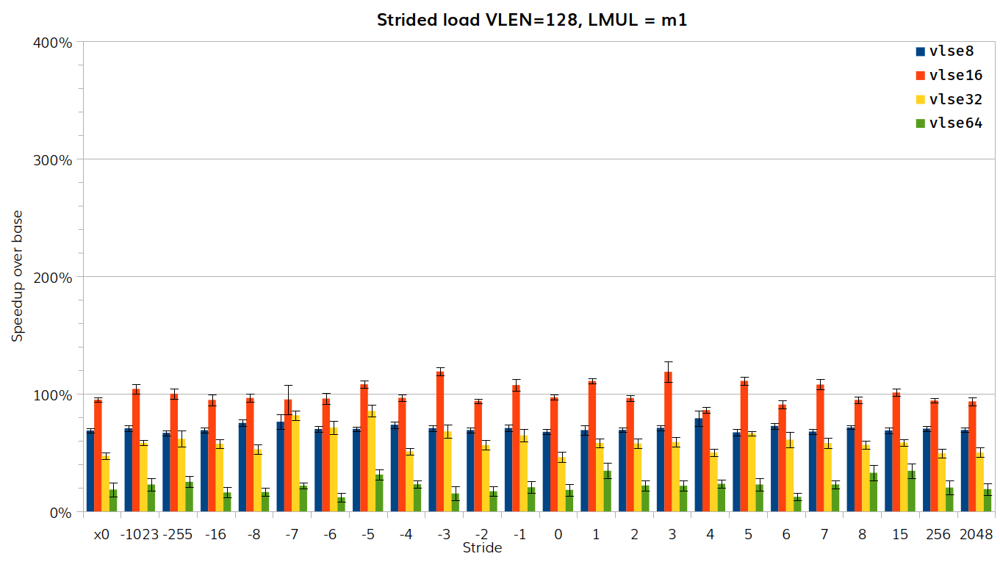
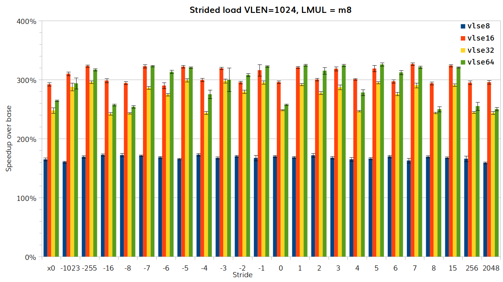
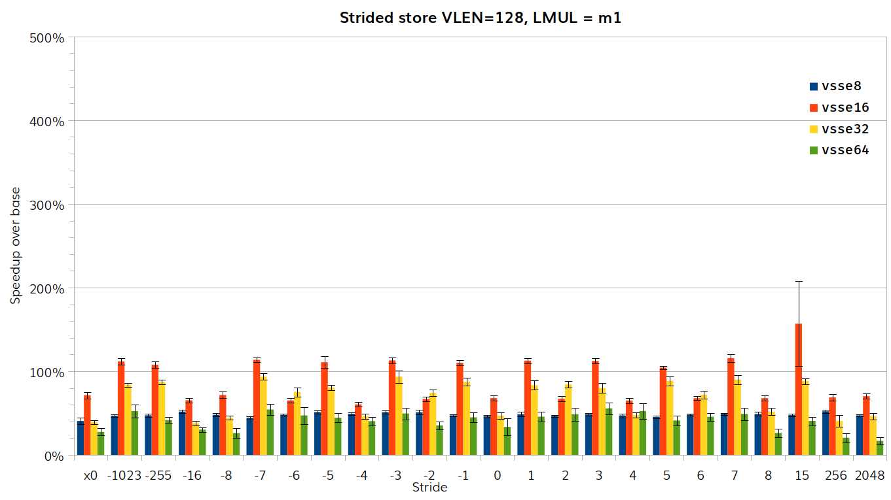
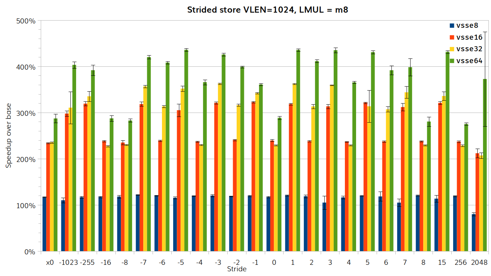
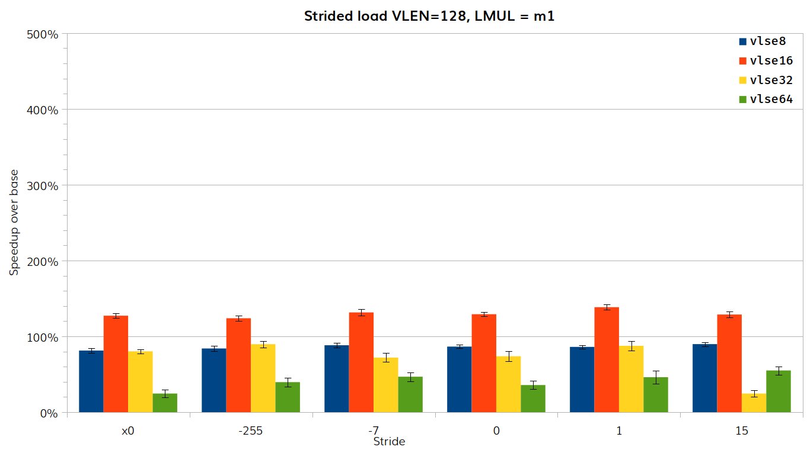
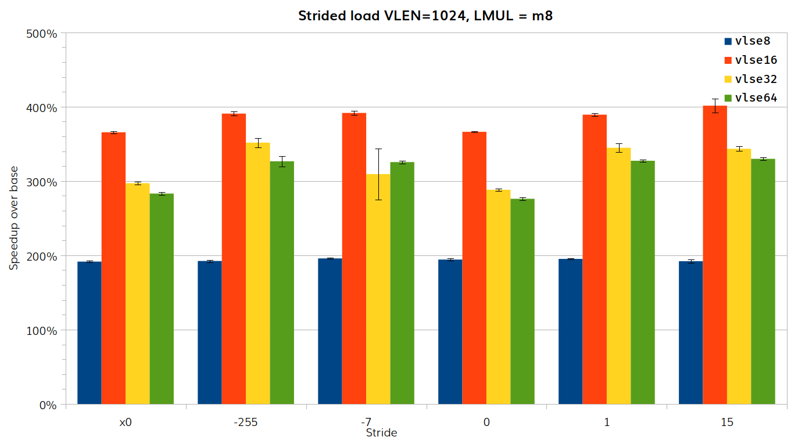
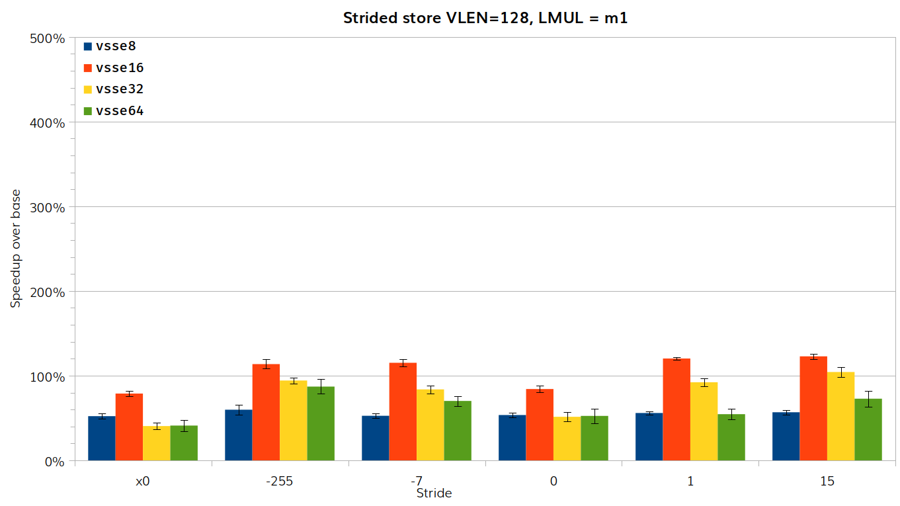
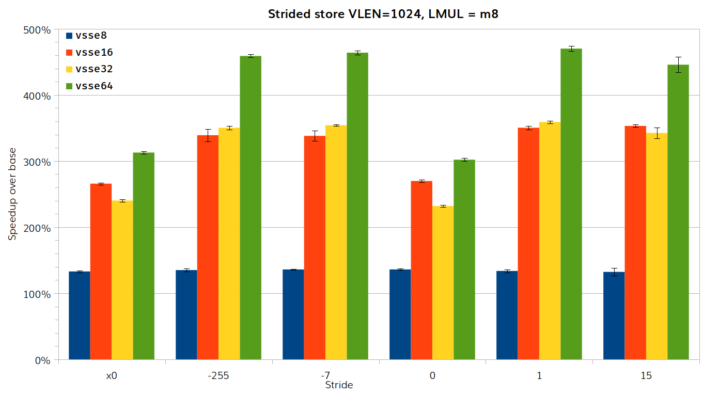

# RISE RP005 QEMU weekly report 2025-02-12

All patches have been submitted for all milestones.  We therefore anticipate
this will be the last regular meeting.

## Milestone 2

**COMPLETE.**

## Milestone 3

- Generate TCG Ops for vector whole word load/store.
  - **IN PROGRESS**.
  - Initial review comments from Alex Bennée, but no response to follow-up questions.
  - New version will add options to specify bounds for when to use TCG Ops and when to use helper functions, rather than relying on host architecture `#ifdef`.

- Improve fault-only-first handling for vector load helper functions.
  - **IN PROGRESS**.
  - New version in development based on review comments from Daniel Barboza.

- Improve strided load/store helper functions.
  - **IN PROGRESS**.
  - Helper function could not easily be improved, so we have submitted a [patch](https://lists.nongnu.org/archive/html/qemu-devel/2025-02/msg02294.html) to use TCGOp generation instead.
  - Speedups of up to 500% over current performance achieved, with no slowdowns.

## Statistics

### Instruction timing for strided load/store: impact of stride value

- Baseline commit: 131c58469f
- Test commit: 2f3d8a041e

Our initial data was obtained for an earlier version of the patch using 24 diffeent stride sizes.  It represents over 30,000 data points requiring over 120,000 timing runs over more than 24 hours.  From this we see that the size of the stride has little effect on the speedup optained.  This is true for load or store, and across values of LMUL and VLEN.  The following two graphs show the results for load instructions, the first for VLEN=128/LMUL=m1, the second for VLEN=1024/LMUL=m8.

The following two graphs show  the results for store instructions, the first for VLEN=128/LMUL=m1, the second for VLEN=1024/LMUL=m8.

These data clearly show that while VLEN and LMUL have a significant impact on the speed improvement seen, the stride size does not.  As such we can use a smaller set of stride values for future runs.  It is sufficient to measure a stride of 0 (including the variant using `x0`), the unit stride, one other positive stride and two negative strides.  With these values a timing run can be completed in around 8 hours.

### Instruction timing for strided load/store: final performance figures

- Baseline commit: ffaf7f0376
- Test commit: 041f4e8508

This is the final commit used in the patch, which fixes some issues around mask handling.  We run tests with a reduced set of stride values.  This comprises around 7,500 data points, obtained from 30,000 timed runs.  The main data is shown for a modern AMD processor, but we also obtained data for an older Intel processor, where the speedups were approximately 20% less.

For load instructions, we see speedup over the exisiting implementation for all configurations, with speedup in excess of 300% above baseline in several cases when using large vectors.  The following two graphs show the results for load instructions, the first for VLEN=128/LMUL=m1, the second for VLEN=1024/LMUL=m8.

For store instructions, we see speedup over the existing implementation for all configurations, with speedups in excess of over 400% above baseline in several cases when using large vectors.  The following two graphs show  the results for store instructions, the first for VLEN=128/LMUL=m1, the second for VLEN=1024/LMUL=m8.

The following two graphs look at the impact of VLEN on strided load, the first for `vlse8` and LMUL=m1, the second for `vlse64` and LMUL=m8.

We can see that for small vectors and LMUL, the speedup increases with VLEN, while for large vectors and LMUL, there is a drop off in speedup for the very largest vectors.

The last two graphs look at the impact of LMUL on strided load, the first for `vlse8` and VLEN=128, the second for `vlse64` and VLEN=1024.

We can see that for small vectors, the impact of LMUL is negligible, while for large vectors, the the speedup increases with increasing LMUL.

## Other

This is the last regular meeting of this group.  Thank you for your participation.
